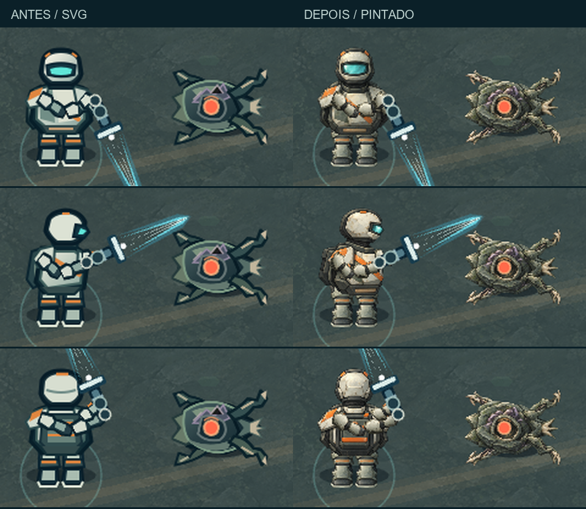

# Warrior & Hollow — painted character pass

Base: **0.1.32**, ambiente D/Hybrid aprovado pelo usuário. Esta passagem aplica o mesmo tratamento de material e volume ao Galactic Warrior e ao Hollow Crawler, dentro de Organic Sci-Fi R3. Versão resultante: **0.1.33**.

## Comparação visual



Capturas completas, com câmera fixa em (1000, 730), jogador em (1000, 730), zoom original e viewport 1280×720:

| Mira | Antes | Depois |
| --- | --- | --- |
| Baixo / frontal | [Antes](before-down.png) | [Depois](after-down.png) |
| Cima / traseira | [Antes](before-up.png) | [Depois](after-up.png) |
| Direita | [Antes](before-right.png) | [Depois](after-right.png) |
| Esquerda | [Antes](before-left.png) | [Depois](after-left.png) |
| Superior esquerda | [Antes](before-up-left.png) | [Depois](after-up-left.png) |
| Superior direita | [Antes](before-up-right.png) | [Depois](after-up-right.png) |
| Inferior esquerda | [Antes](before-down-left.png) | [Depois](after-down-left.png) |
| Inferior direita | [Antes](before-down-right.png) | [Depois](after-down-right.png) |

Estados capturados: [caminhada](walking.png), [swing](attack-swing.png), [carga](charge.png), [release](charge-release.png), [Dash](dash.png) e [Hollow perseguindo](hollow-chase.png). Capturas usam preparação de cena por hooks DEV; ações usam eventos reais de teclado/mouse. Pulsos ambientais e carregamento das fontes externas podem variar entre capturas; não foram alterados.

Para jogar, execute `npm run dev` e abra a URL indicada pelo Vite. Os novos personagens estão no jogo normal, na Forest e na Cavern; não é necessário abrir o laboratório de rochas.

## Tratamento visual

- **Warrior:** capacete físico com visor ciano, armadura clara usada, tecido escuro nas juntas, pequenos acentos industriais laranja. Frente, costas e perfil continuam sendo vistas de um humano em pé. Mochila subordinada ao torso; botas separadas.
- **Hollow:** carapaça mineral/orgânica, juntas e membros flexíveis, extremidades ósseas, manchas violetas e valores de sombra pintados. O núcleo quente e seu feedback existente permanecem.
- **Materiais:** volumes modelados por pintura, luz superior esquerda, oclusão nas junções e desgaste seletivo. Não há substituição por facetas triangulares ou novo estilo de pixel art.

As imagens foram criadas com a ferramenta integrada `imagegen`, usando as peças SVG aprovadas como referências de forma e `world-rock.png` do ambiente aprovado como referência de pintura. [sources.json](sources.json) guarda prompts e identificadores dos originais; [references/](references/) contém os renders das peças anteriores. Não foram baixados assets externos.

## Assets e integração

| Asset PNG | Dimensões |
| --- | --- |
| `warrior-body`, `warrior-body-back`, `warrior-body-side` | 360×400 cada |
| `warrior-boot` | 160×400 |
| `warrior-saber-arm` | 160×72 |
| `hollow-body`, `hollow-forelimbs`, `hollow-rear-limbs` | 320×256 cada |

Os oito arquivos RGBA somam **563.927 bytes (~551 KiB)** em `public/assets/visual/characters/`. Alpha e padding são reais; não há fundo pintado. [asset-measurements.json](asset-measurements.json) registra dimensões, retângulos ocupados, tamanhos e hashes.

O pós-processamento é feito **offline**, com Pillow:

```powershell
python scripts/prepare-character-art.py <pasta-dos-PNGs-originais-gerados>
```

O script recorta, redimensiona e registra cada pintura no retângulo ocupado pela peça original. Conserva o padding intencional das botas e pares de membros; usa quatro pixels de textura por unidade de mundo. Os originais gerados permanecem na pasta local `CODEX_HOME/generated_images`, identificados no manifesto. Regenerar por prompt pode produzir outra pintura; o PNG final versionado é o asset efetivamente utilizado.

`GameScene.preload` passa a carregar PNG via `load.image`, mantendo as nove chaves anteriores. As duas mangas usam a mesma imagem, sob as chaves de braço principal e apoio. `Player.ts`, `EnergySaber.ts` e `HollowCrawler.ts` não foram modificados: display sizes, origins, pivôs, containers, rotação, ciclo de passos e escalas de reação continuam os mesmos.

A hierarquia continua `Player → bodyRig → handAnchor → EnergySaber`. A luva de apoio acompanha o segundo grip existente. A preparação não muda posições de gameplay nem colisores.

## Validação técnica realizada

- `npm run typecheck`: passou.
- `npm run build`: passou. Permanece o aviso de tamanho do chunk Phaser.
- Reuso do QA existente: Forest, 3 Echoes e XP, mecanismo, passagem, Cavern, Deep Signal, colisão, LMB, Q hold/release, morte e respawn preservando XP/level/Echoes/passagem.
- Teste do rig: oito direções de mira; caminhada WASD; swing, carga, release e Dash; hierarquia e os dois grips alinhados em coordenadas de mundo; corpo/pernas continuam eretos. Hollow continua movendo e animando os membros.
- Touch emulado no Chrome: movimento, STRIKE direcional, CHARGE hold/release e Dash.
- Gamepad API simulado: movimento, mira e LT hold/release.
- Viewports: 1280×720, 1366×768, 1920×1080 e 844×390.
- Build de produção via preview: oito pinturas carregadas sem erro, canvas visível e eventos de teclado/mouse. [Captura de produção](production.png).
- Console/JS/HTTP: nenhum erro nos testes registrados.

Reproduzir com Playwright e Chrome já disponíveis localmente, sem instalar dependências no projeto:

```powershell
node scripts/capture-character-art.mjs http://localhost:5174/ after
node scripts/qa-environment-art.mjs http://localhost:5174/ - docs/character-art-pass
node scripts/qa-character-rig.mjs http://localhost:5174/ http://localhost:5175/
```

O último comando pressupõe um preview já iniciado em 5175. Não há script `npm test` configurado. [measurements.json](measurements.json) e [rig-checks.json](rig-checks.json) guardam os resultados reais.

## Performance e física

- Mesma cena de comparação: **66 objetos raiz, 48 chaves de textura, 10 Graphics, 3 RenderTextures e 3 tweens**, antes e depois. A contagem é da lista raiz da cena, não de todos os filhos dos containers.
- Obstáculos e bounds foram comparados integralmente entre [baseline anterior](before-baseline.json) e [posterior](after-baseline.json): iguais.
- Capturas de comparação: FPS instantâneo de **56,1 antes** e **58,1 depois**. São amostras curtas, não um benchmark.
- Teste amplo: médias de aproximadamente **54–57 FPS** durante navegação/capturas. Cavern após estabilização, em amostragem separada de quatro segundos: **59,8 FPS**, intervalo **59,5–59,9**.
- Sem crescimento de objetos, texturas ou tweens após espera e três reinícios de cena no QA existente.
- Nenhuma geração de pintura, novo objeto visual, novo tween ou novo Graphics por frame. O cenário permanece com o mesmo bake/cache.

Os PNGs aumentam o download dos personagens; não foi medido carregamento em rede móvel real. Não houve regressão relevante observada neste ambiente de teste, mas a amostra não certifica todos os dispositivos.

## Avaliação visual e limites

As capturas do Chrome foram inspecionadas diretamente: a pintura se distingue dos SVGs anteriores, mantém o Warrior humano e em pé, as mãos no cabo e o Hollow orgânico. **Automação passou. Playtest humano necessário** para aprovar definitivamente o estilo dos personagens e sua leitura em combate.

Não foi realizado teste físico em PC interativo, iPhone ou gamepad nesta passagem. Touch e gamepad foram emulados. A geometria simples das luvas, núcleo, sabre e VFX continua a existente; esta passagem troca somente a arte das peças do corpo e membros.

O fluxo, dano, HP, alcance, cooldowns, IA, patrulhas, progressão, Echoes, colisões, câmera, controles, áudio, HUD e cenário permanecem intactos. Os SVGs anteriores foram preservados; restaurar o carregamento SVG no manifest de `preload` reverte a arte sem refazer os rigs.
