# Environment art pass — approved D language

Version **0.1.32**, based on the user's selection of D (Hybrid) and explicit
approval to begin with Cavern and Forest. Organic Sci-Fi R3 and
[World Shape Language](../WORLD_SHAPE_LANGUAGE.md) remain authoritative.

## What changed

The main game now uses painted raster stone, contact shadows, root aprons,
continuous shelf paintings, mineral growths, tree trunks/crowns and weathered
ancient bases. Quiet soil/slate materials and rounded background color masses
support the existing routes. Human survey equipment retains its industrial forms.

Forest keeps its seeded placement, paths, tree anchors, canopy sway and depth
bands. Cavern keeps its descent, mineral pocket, ancient face, corridor and
deep area. The moving seals/collapse pieces use painted Images with the same
animation targets and durations. Existing inscriptions, pulses, interaction
messages and signals remain independent of the new physical surface paintings.

No gameplay values, enemy art, Warrior art, routes, collision data, camera,
controls, progression, HUD or audio were changed. The original rendering lab
and its A/B/C/D assets remain available at `rendering-lab.html`.

## See it

Run `npm run dev` and open the normal game at the URL Vite prints. Investigate
the three existing Echoes, locate the northern fissure, activate the mechanism
and enter Cavern; approaching the collapse continues to the deep area.

These comparisons use **1280×720, the same zoom, camera center and player
setup**. Enemies are frozen only for matched captures, not in the game.

| Region | Before, 0.1.31 | After, 0.1.32 |
| --- | --- | --- |
| Forest | 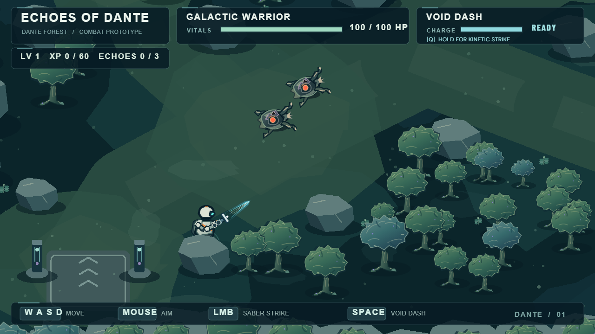 | 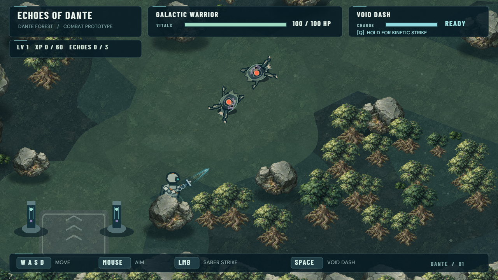 |
| Northern sites | 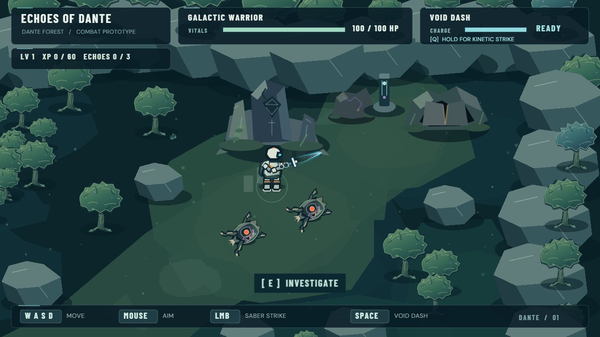 | 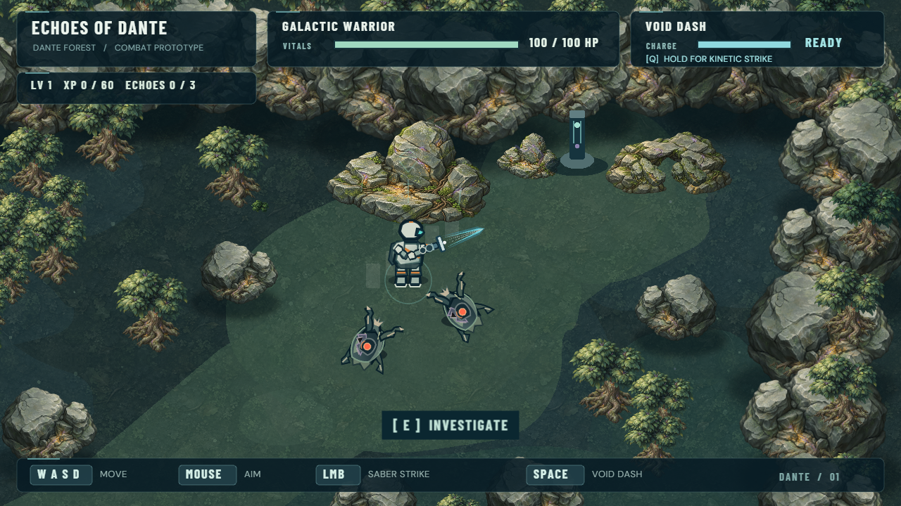 |
| Cavern | 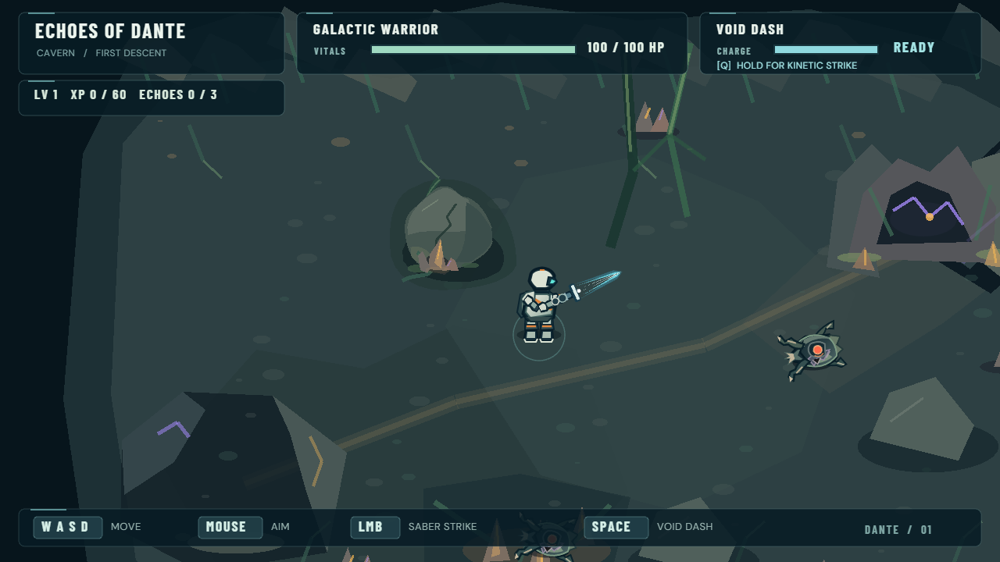 | 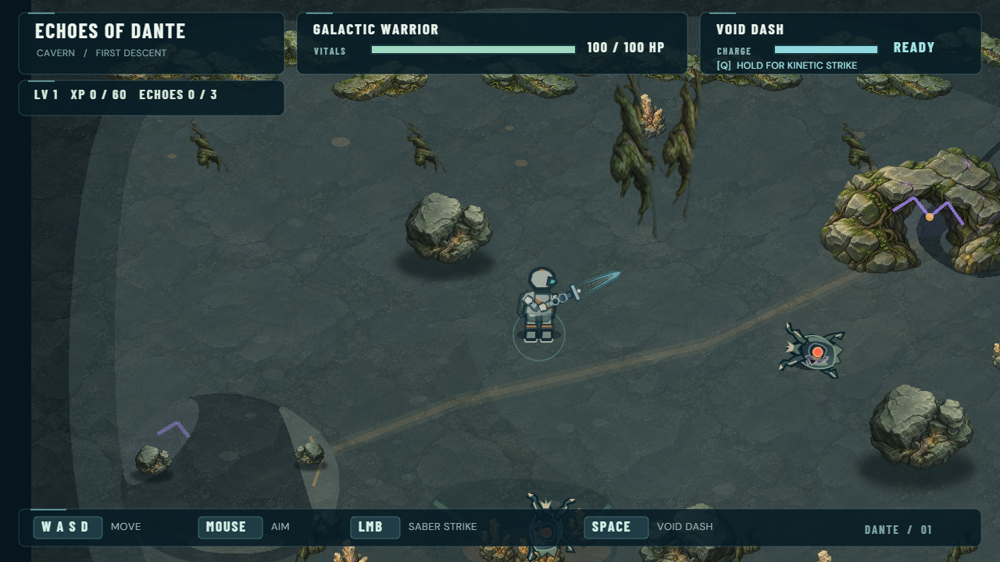 |
| Ancient face | 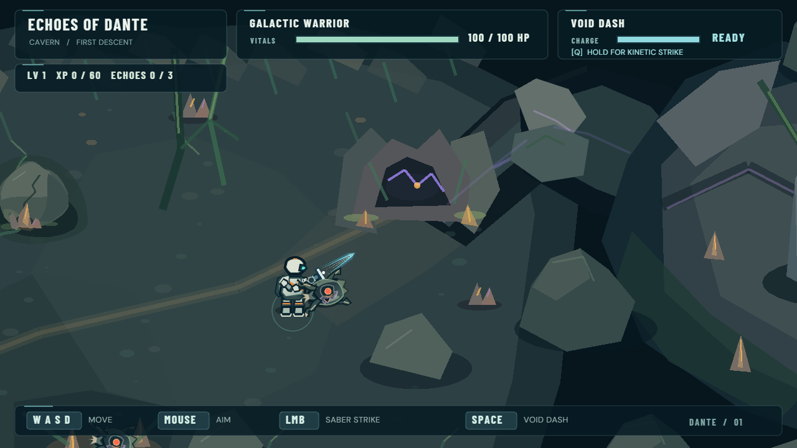 | 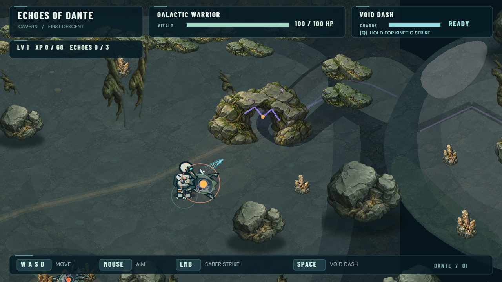 |
| Deep area | 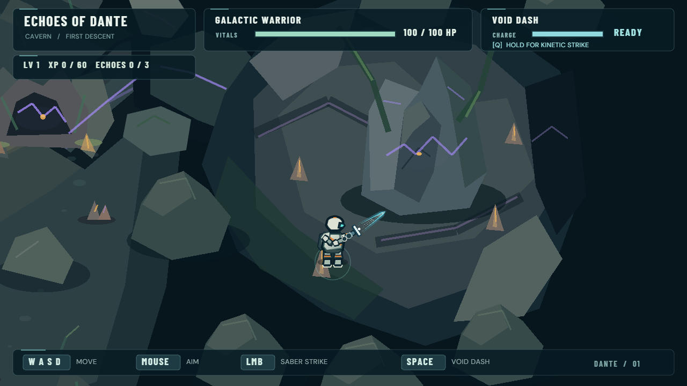 | 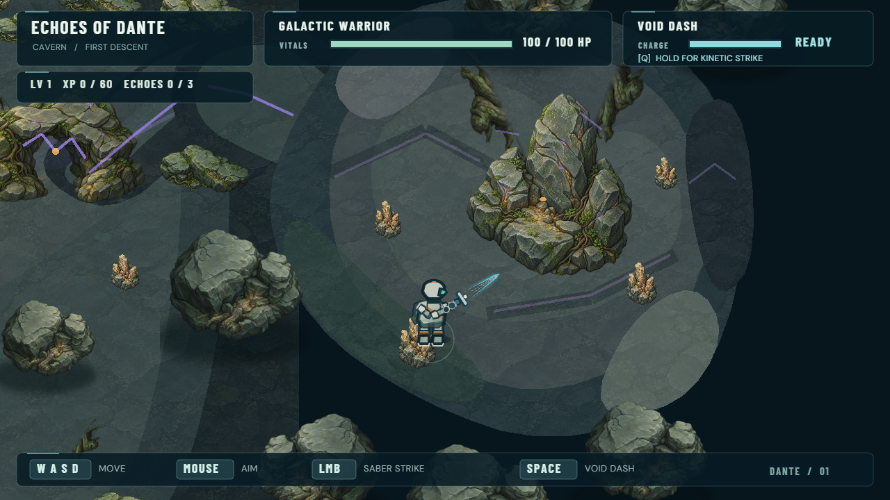 |

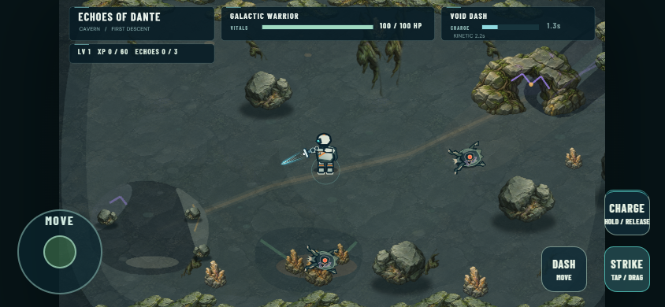

## Assets and authoring

The 11 production PNGs in `public/assets/visual/environment/` total
**2,269,067 bytes (about 2.16 MiB)**. They are original assets, not downloaded
game art. Source illustrations were generated with imagegen using the approved
D painting as a material/shading reference. The eight authoring prompts are
recorded in [authoring-prompts.json](authoring-prompts.json).

| Asset | Canvas | Role |
| --- | --- | --- |
| world-rock | 512×512 RGBA | Approved painted stone, copied from C/D |
| world-shadow | 512×512 RGBA | Approved contact shadow |
| rock-shelf | 512×512 RGBA | Broad continuous outcrop |
| mineral-growth | 512×512 RGBA | Unequal mineral growth, embedded base |
| ancient-frame | 512×512 RGBA | Weathered frame with a transparent throat |
| ancient-remnant | 512×512 RGBA | Buried fractured base |
| forest-canopy | 200×150 RGBA | Shared crown, two modest tint variants |
| forest-trunk | 220×155 RGBA | Trunk/root painting, original origin retained |
| root-growth | 256×128 RGBA | Painted low root apron derived from the trunk |
| forest-ground | 512×512 RGB | Quiet soil material |
| cavern-ground | 512×512 RGB | Quiet slate material |

`scripts/prepare-environment-art.py SOURCE_DIRECTORY` normalizes/crops the
original source paintings, preserves alpha, prepares tile edges and creates
the root apron offline with Pillow. It retains source files. Fresh imagegen
outputs are not deterministic; the committed PNGs are the runtime source of
truth. The script requires the named authoring source files, which were retained
outside the repository; no generation or Pillow dependency exists in the game.

## Runtime

`GameScene.preload` calls `preloadEnvironment`, honoring Vite's base URL.
`EnvironmentPainter` reuses temporary Images to stamp paintings into existing
RenderTextures and disposes its pool after each bake. Soil materials tile at
world coordinates; the deep material is clipped to its authored ground with
a temporary geometry mask, avoiding a rectangular painted edge at the section join.

Forest still has 16 RenderTextures and Cavern 3. Trees and moving plates retain
individual Images because their existing layering/animation needs them.
Seeded physics positions are registered exactly as before. Modest mirroring,
rotation and tint variation do not consume placement RNG. There is no new
per-frame environment drawing, particle system or continuous tween.

## Validation and limits

See [measurements.json](measurements.json) for the executed Chrome results.
`scripts/qa-environment-art.mjs [URL] [optional baseline JSON]` checks the main
route, collision/Dash, LMB, charge/release, Hollow death/XP, player death/respawn,
Deep Signal, standard gamepad mock, CDP touch gestures, four viewport sizes,
matched captures and object/texture stability through three scene restarts.

The baseline argument contains top-level forest/forestNorth/cavern/cavernFace/
deep snapshots with obstacle arrays and bounds. The audit compared those
arrays and bounds to the pre-change runtime snapshot, not just object counts.
No separate npm test suite exists. Historic lab QA was adapted without
overwriting its original measurements; the lab also received a smoke check.

Browser automation and visual inspection of these captures are not a physical
PC, controller or iPhone playtest. User approval of D applies to the laboratory;
**human playtest of this world integration is still necessary**. Check material
readability, repeated motifs, passage readability, foliage overlap and whether
the existing Warrior/Hollow remain prominent against the painted environment.

The kit is deliberately small: some repeated silhouettes remain. Static
inscriptions, human equipment and ground layout marks retain their existing
rendering. This pass adds a 2.16 MiB asset download; network/mobile startup and
hardware performance still require real-device evaluation.

## Executed results

Typecheck, production build, full DEV browser regression and production asset/input
smoke check passed with zero JavaScript/asset errors. The usual existing large
Phaser bundle warning remains. All compared obstacle arrays and area bounds were
identical; idle and three restarts had stable objects/textures/tweens.

| Matched view | Before FPS | After FPS | Objects before / after | RenderTextures |
| --- | ---: | ---: | ---: | ---: |
| forest | 53.6 | 56.0 | 370 / 371 | 16 |
| forestNorth | 56.8 | 56.1 | 370 / 371 | 16 |
| cavern | 58.0 | 55.8 | 66 / 66 | 3 |
| cavernFace | 59.3 | 55.8 | 66 / 66 | 3 |
| deep | 59.6 | 56.3 | 66 / 66 | 3 |

These short headless samples include post-load settling and machine scheduling
variation; they are not controlled hardware benchmarks. An additional idle
observation after 10 seconds of settling averaged 59.0 / 59.9 / 60.0 FPS for
Forest / Cavern / Deep. That observation preceded the final bake-only seam-mask
adjustment. No steady-state rendering work or continuous tweens were added.
The final local DEV startup-to-ready measurement was 2530 ms, with no
matched pre-change startup benchmark; network and physical mobile performance
are still unverified. The new trace painting accounts for the one extra Forest
object, rather than new objects for every painted environmental detail.
