# Environmental Cohesion & Grounding — 0.1.39

Passagem visual sobre a linguagem **D / Organic Sci-Fi R3** já aprovada.
Forest, Cavern, Deep Cavern, exterior, Primeiro Eco/limiar e arena do Warden
mantêm o mesmo fluxo. Nenhum asset novo foi necessário.

## Diagnóstico e alterações

- A sombra existente tinha sua pintura na parte inferior de um canvas transparente
  de 512×512. Escalar esse canvas inteiro deslocava o contato e produzia sombras
  fracas ou afastadas. Um frame de **293×131**, na mesma textura, utiliza apenas
  a pintura da sombra; não cria PNG, textura GPU ou geração de arte.
- Rochas compartilham uma base de contato, raiz curta e detrito pequeno, todos
  baked. Árvores recebem contato sob o tronco. Estratos, minerais e estruturas
  recebem transições de solo, raízes e fragmentos rasos, preservando os caminhos.
- As quatro formações secundárias do exterior passam de 280×200 / 355×250
  para aproximadamente 242×157 / 310×184. Na aproximação, largura passa de
  4,4 para 3,5 vezes o raio físico, e altura de 3,2 para 2,25. As bases visuais
  continuam cobrindo os footprints existentes. Não é uma redução global.
- Rochas comuns preservam a largura e recebem altura 8% menor, posição de base
  recalibrada e contraste mais contido. Arco, arquivo, face e limiar monumental
  preservam sua escala de landmark; Warrior, Hollow e Warden não mudaram.
- A textura repetida do solo passa a ter menos contraste. Massas claras do
  exterior e da aproximação são menos dominantes; sombra ampla e suave nas
  bordas cria variação de valor sem adicionar ruído ao caminho.
- A distribuição dos objetos sólidos permanece. Microdetritos e raízes na base
  formam agrupamentos locais, em vez de acrescentar novos obstáculos.

## Profundidade e execução

Grandes massas de borda permanecem baked e com contraste reduzido. Caminhos
ficam visualmente tranquilos. As bandas existentes da Forest continuam ordenando
os corpos, com sombras no chão. **20 corpos estáticos** da Cavern completa passam
a ser Images ordenadas pelos pés: três rochas da primeira sala, uma divisória
profunda, seis obstáculos da continuação, quatro formações exteriores e seis
formações da aproximação. Assim o jogador pode passar atrás, sem desenhar todos
os detalhes de novo. Não recebem update, listener ou tween.

Sombras, raízes e detritos permanecem nas caches, sem objetos individuais em
runtime. Cavern conserva oito RenderTextures; arena conserva uma. A Forest usa
15 bandas/caches no enquadramento registrado, contra 16 antes, em decorrência
da distribuição das bases nas bandas já existentes. Não há textura GPU adicional,
novo efeito contínuo ou redesenho estático por frame.

Os assets reutilizados são `world-rock`, `world-shadow`, `root-growth`,
`rock-shelf`, `deep-stratum`, `exterior-outcrop`, minerais, solos e estruturas
ancestrais do kit existente. Arquivos PNG, personagens e seus rigs permanecem
intactos. As inscrições e respostas do Signal mantêm seus sistemas e valores.

## Comparação visual

1280×720, mesmo zoom, centros de câmera e posições do Guerreiro. Preparação DEV
e inimigos congelados somente nas capturas; esses estados não representam uma
partida percorrida integralmente. Inscrições e animações ambientais podem variar
ligeiramente com o tempo da captura.

| Região | Antes | Depois |
| --- | --- | --- |
| Forest | 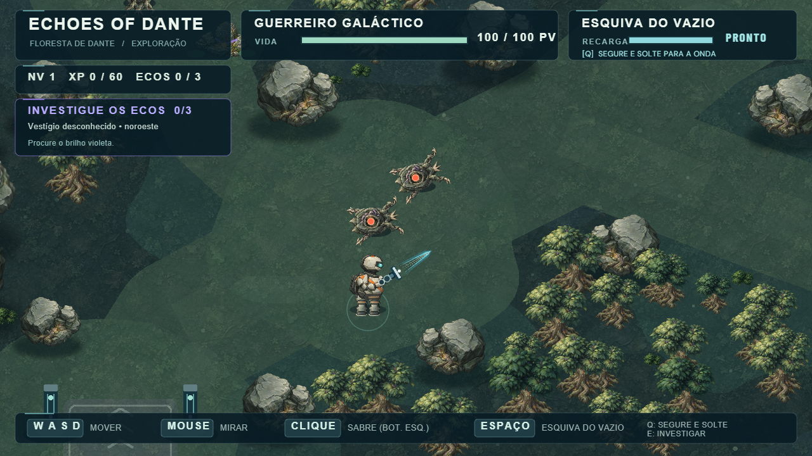 | 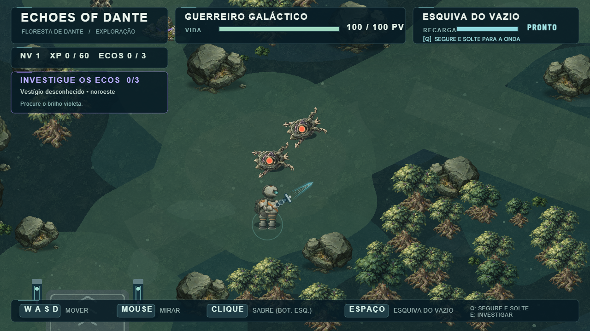 |
| Cavern | 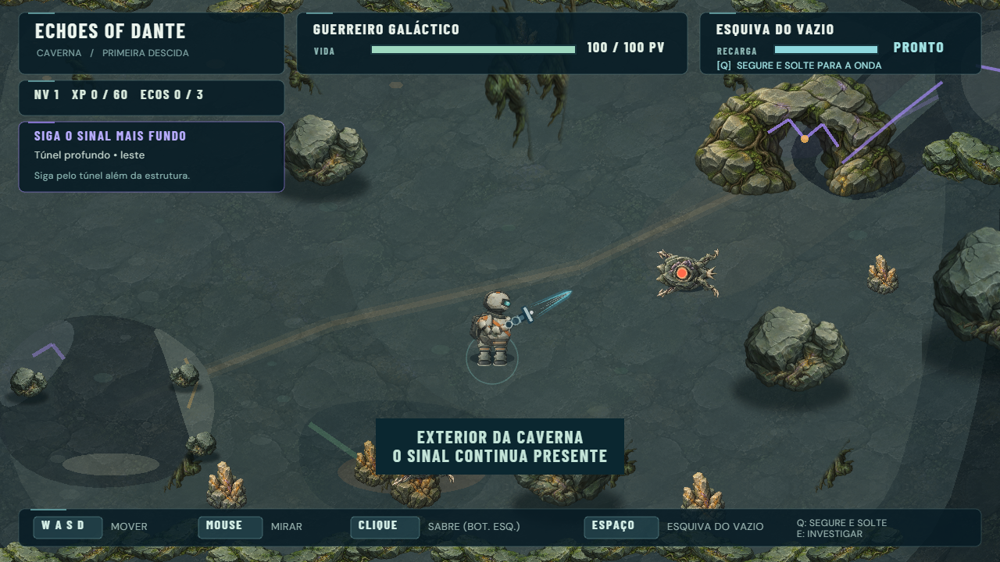 | 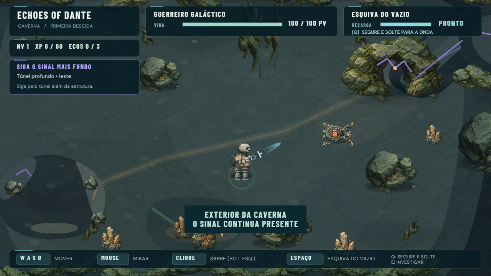 |
| Deep Cavern | 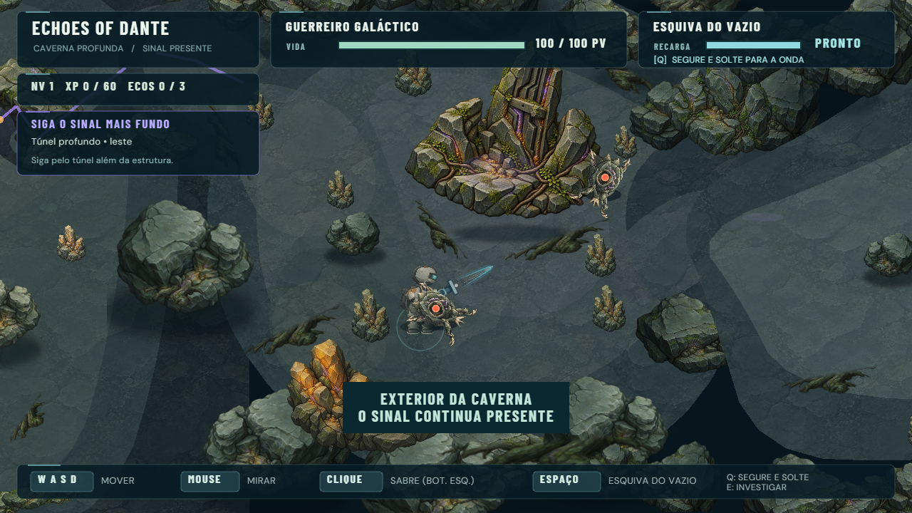 | 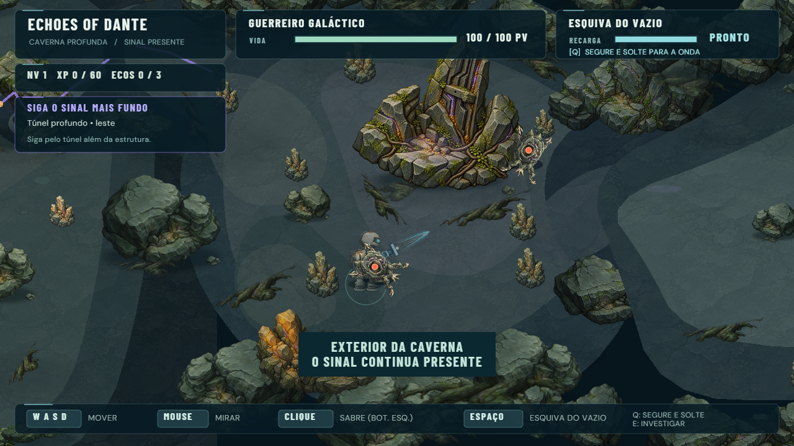 |
| Exterior | 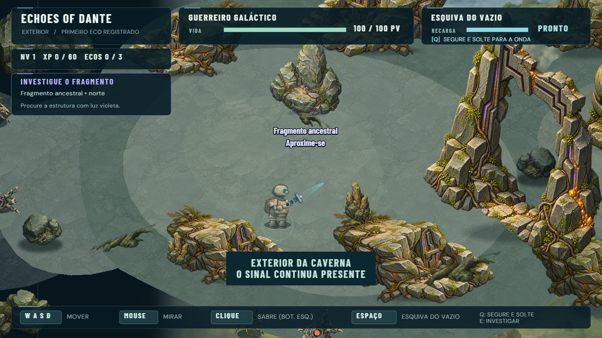 | 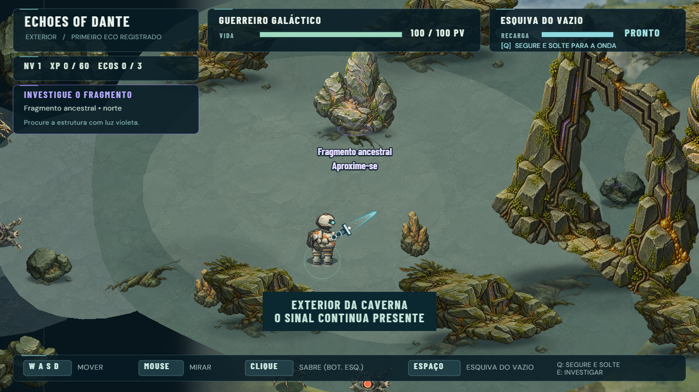 |
| Primeiro Eco / limiar | 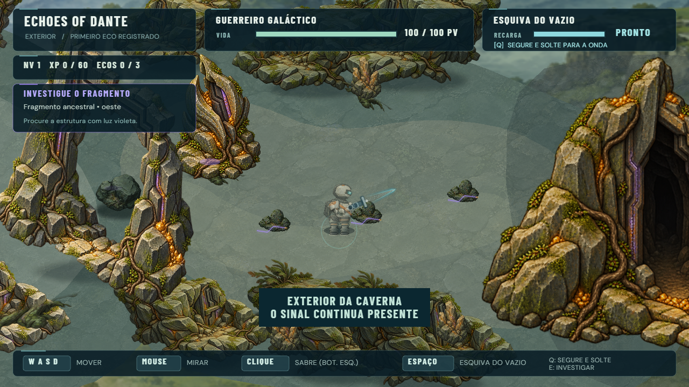 | 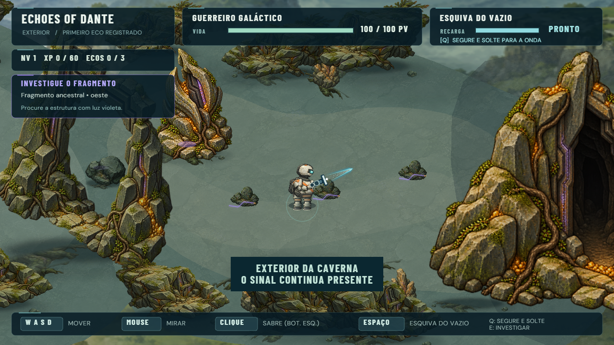 |
| Warden | 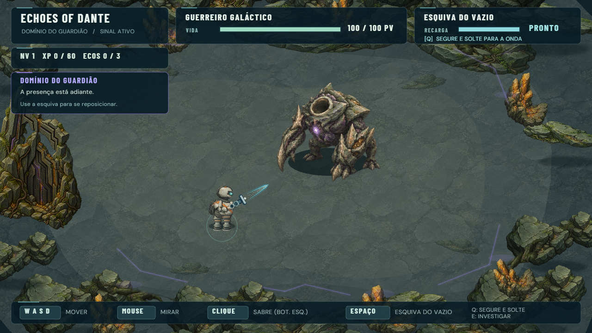 | 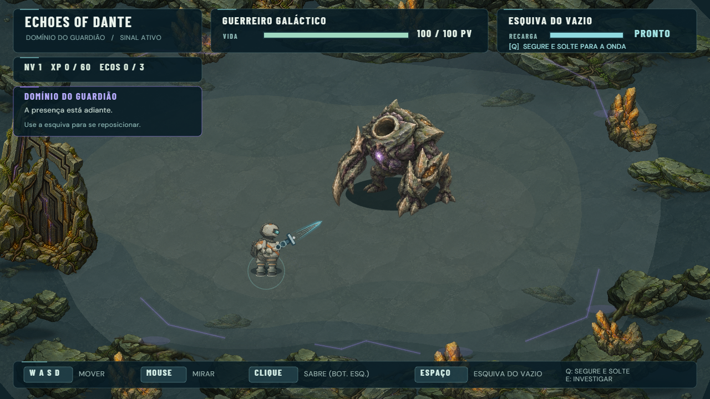 |

## Validação

`qa-environment-cohesion.mjs` compara os dados físicos antes/depois, incluindo
os 198 obstáculos da Forest, 121 da Cavern aberta e 20 da arena ativa. Confirma
igualdade exata dos arrays, limites e zoom. A sequência existente verifica os
estados reais de acesso; ter contato visual diferente não altera a colisão.

Os relatórios de QA desta passagem ficam em [qa/](qa/). São testes de Chrome
headless com teclado/mouse, Gamepad API mock e touch CDP. Não são testes físicos
de iPhone, controle ou console. O projeto não possui script `npm test`; os scripts
de QA existentes são usados diretamente. Typecheck e build são gates separados.

As amostras curtas de FPS nos relatórios de captura são tomadas logo após
reload/restart, enquanto a média do Phaser ainda inclui o carregamento. Não são
usadas como medição de regime estável. Os relatórios de percurso e boss medem
depois do aquecimento, com entidades ativas.

### Resultados executados

| Verificação | Resultado |
| --- | --- |
| `npm run typecheck` | Passou |
| `npm run build` | Passou; aviso já existente do tamanho do chunk Phaser |
| `qa-environment-cohesion.mjs` antes/depois | Seis enquadramentos; arrays físicos, limites, zoom e quantidade de texturas iguais |
| `qa-cavern-exterior.mjs` | Forest, 3 Ecos, fissura, mecanismo, Cavern, passagem profunda, rota principal/lateral, exterior, combate, retorno, colisão, respawn e três reinícios estáveis |
| `qa-warden-preparation.mjs` | Primeiro Eco, resposta, limiar, ida/volta, três mortes, acesso à arena, estado único e progresso preservado |
| `qa-warden-boss.mjs` | Entrada, intro, três mortes/reinícios, vitória única, retorno, reload, gamepad mock e touch |
| `qa-warden-patterns.mjs` | Cinco ataques com dano real, desvios, três fases, Saber, Charge, Dash e pool estável |
| `qa-cavern-exterior-production.mjs` | Assets carregados, inputs PC enviados, ausência de hook DEV e nenhum erro |

Os testes de percurso, preparação e boss incluem **1280×720, 1366×768,
1920×1080 e 844×390**, além de touch emulado e Gamepad API mock. Todos os
relatórios finais registram zero erros JavaScript/carregamento. A primeira
tentativa do percurso foi interrompida por reload do Vite durante uma edição;
a repetição com o código estabilizado passou.

FPS médio em regime estável: **59,94** no percurso/exterior, **60,14** na
aproximação e **60,03** no combate do Warden. A medição anterior registrada pelo
mesmo QA de padrões do boss era **60,33**; a diferença é pequena nesta máquina.
São medições aproximadas de Chrome headless, não promessa de FPS em aparelhos
reais. Sem novos tweens ou listeners; três respawns da Cavern mantiveram 211
objetos, oito caches e 64 texturas, e os do Warden mantiveram 71 objetos, uma
cache e 65 texturas. Não se observou crescimento contínuo.

A revisão visual foi feita sobre os comparativos e capturas de desktop/touch.
Os testes usam configurações DEV controladas em alguns pontos, como posição e
HP do boss para testar o golpe final. Não representam um playtest humano nem
validam novamente a dificuldade do encontro.

## Arquivos

- [EnvironmentArt.ts](../../src/visual/EnvironmentArt.ts): frame de contato,
  composição de bases e poucos corpos com ordenação pelos pés.
- [Arena.ts](../../src/systems/Arena.ts): solo, contato de troncos e bandas da Forest.
- [CavernArea.ts](../../src/systems/CavernArea.ts),
  [DeepCavernArt.ts](../../src/visual/DeepCavernArt.ts) e
  [CavernContinuation.ts](../../src/systems/CavernContinuation.ts): integração,
  contraste e escala da sequência subterrânea/exterior.
- [WardenApproach.ts](../../src/systems/WardenApproach.ts) e
  [WardenArena.ts](../../src/systems/WardenArena.ts): composição ambiental dos
  marcos e margens, preservando encontro e respostas narrativas.
- [QA comparativo](../../scripts/qa-environment-cohesion.mjs), esta documentação,
  imagens/relatórios locais, README principal e technical decisions.
- `package.json` e `package-lock.json`: versão 0.1.39.

## Revisão visual e limites

A inspeção dos comparativos mostra menor dominância das formações secundárias,
contato mais próximo das bases e caminhos com menos competição de textura.
Nenhuma dessas observações substitui o playtest humano.

Os limites persistentes a observar são a leitura de algumas grandes massas de
cor do terreno, as transições nas extremidades das caches e oclusão dos monumentos
em telas estreitas. As pinturas mantêm uma iluminação interna fixa; não existe
iluminação física global. Bandas da Forest continuam uma aproximação de sorting.

### Playtest humano necessário

Percorra Forest → Cavern → Deep Cavern → Exterior → Primeiro Eco → Warden.
Compare a escala com o Guerreiro e Hollows, circule atrás das formações, observe
se as bases ainda parecem recortadas e confira a leitura de caminhos/avisos de
ataque em desktop e mobile. Esta passagem preserva a direção artística e prepara
uma revisão perceptual; não declara integração perfeita apenas pelo QA.
