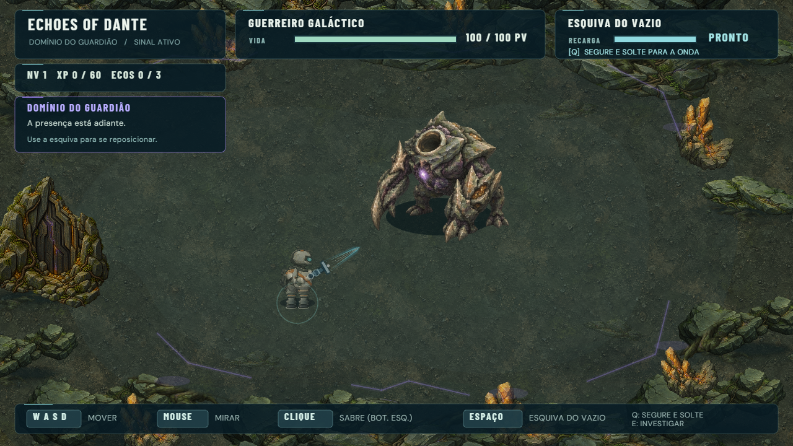
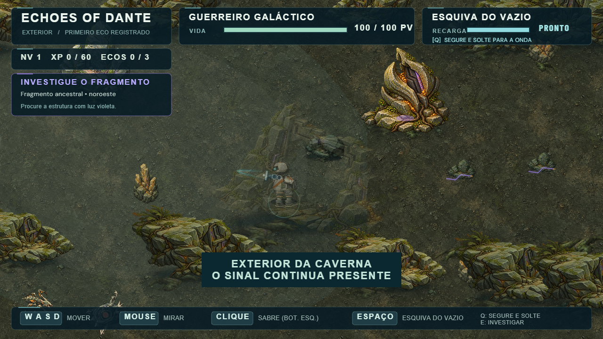

# Correção de chão, escala e oclusão — 0.1.40

O usuário rejeitou o resultado perceptual de 0.1.39: formações ultrapassavam as
bordas do terreno, o chão continuava parecendo um recorte e monumentos ocultavam
completamente o Guerreiro. Esta revisão trata essas causas, preservando D /
Organic Sci-Fi R3. A aprovação anterior permanece registrada; não é tomada como
aprovação desta correção.

## O que mudou

- Um chão opaco contínuo cobre a Cavern inteira, incluindo os limites das caches
  e bases das formações. A arena recebe o mesmo material. Não há vazio transparente
  sob os obstáculos nem um chão separado para cada formação.
- A ilustração `exterior-atmosphere`, que contém uma paisagem com céu em perspectiva,
  deixa de aparecer sob o jogador como piso. Duas imagens e a sobreposição de massas
  de cor da aproximação foram retiradas; o asset original permanece disponível.
- O novo [material](soil-prompt.md) representa sedimento pisável, não lajes poligonais.
  Os desenhos antigos de solo passam a ser manchas discretas com alpha 0,18;
  sombras, raízes e detritos de contato continuam baked. Inscrições separadas e
  respostas do Signal permanecem.
- Rochas da Cavern preservam largura e contato de base, com altura raster
  equivalente a 0,75 da largura de canvas em vez de 0,92. A Forest conserva suas
  dimensões. O relay profundo passa de 345 para 260 unidades de altura.
- O arco da aproximação passa de 550 para 300 unidades de altura. O limiar passa
  de 640×700 para **600×340**, e a entrada da arena de 325 para 205 de altura.
  O arquivo passa de 245 para 190. As bases foram reposicionadas visualmente;
  locais de interação, footprints físicos e transições de área permanecem.
- Corpos elevados próximos ao jogador passam a alpha 0,28 quando encobrem seu
  corpo, restaurando a opacidade ao sair. As sombras de contato continuam baked
  e visíveis. A animação de abertura possui o alpha durante a própria transição;
  o portão aberto só entra no cálculo de oclusão depois dela.
- As caches profundas passam a incluir toda a pintura do bordo inferior:
  principal 1000×1100 e foreground 430×230, evitando cortar a arte na base.

## Execução e escopo

Um TileSprite estático cobre o terreno, com canvas interno **512×512** e escala
inversa de repetição; não aloca um canvas de 6800×1500. O PNG e o padrão repetido
usam texturas pequenas. Há um objeto e duas texturas adicionais nas áreas
subterrâneas (asset + textura interna do TileSprite), e apenas o preload adicional
na Forest. As oito caches da Cavern e uma da arena permanecem. Dois objetos de
paisagem foram retirados da Cavern.

A lista local de oclusão contém somente corpos ambientais elevados. É reconstruída
na criação da cena; calcula interseções simples e muda alpha, sem listeners,
novos tweens ou redesenho do ambiente por frame. O cálculo não considera pixels
individuais da pintura. Visual e física continuam independentes.

Não há mudança de controles, combate, valores, IA, narrativa, progressão ou áudio.
Os únicos pontos acrescentados à GameScene inicializam e atualizam a oclusão visual.

## Comparação e revisão

Capturas de 1280×720, com câmera/zoom/posição iguais ao comparativo anterior.
Estados DEV e congelamento de inimigos servem à comparação, não ao balanceamento.

| Região | Resultado rejeitado 0.1.39 | Correção 0.1.40 |
| --- | --- | --- |
| Cavern |  |  |
| Deep Cavern |  |  |
| Exterior |  |  |
| Limiar |  |  |
| Arena |  |  |

## Validação

Os resultados executados e as medições ficam nos relatórios desta pasta e em
`qa/`. `qa-environment-cohesion.mjs` exige arrays de colisão, limites e zoom
exatamente iguais à base anterior, além de chão opaco e canvas 512×512.
`qa-ground-occlusion.mjs` verifica redução de altura, transparência/restauração,
quatro resoluções e três reinícios sem crescimento de objetos/texturas/listeners.
Os QA existentes percorrem exploração, interações, combate, portões e respawn.

### Resultados executados

| Verificação | Resultado |
| --- | --- |
| `npm run typecheck` | Passou |
| `npm run build` | Passou; aviso preexistente do chunk Phaser |
| Comparativo de seis regiões | Física/limites/zoom exatamente iguais; chão contínuo opaco e canvas 512×512 confirmados |
| Oclusão | Arco/limiar/arquivo revelam o Guerreiro, opacidade restaura, quatro resoluções e três reinícios estáveis |
| Percurso Cavern/exterior | 3 Ecos, fissura, mecanismo, Deep Cavern, rotas, três tipos de inimigos, XP, volta, três reinícios, touch e gamepad mock passaram |
| Primeiro Eco/limiar | Ida/volta, resposta única, três mortes, estado preservado, abertura real e acesso à arena passaram |
| Encontro Warden | Intro, três mortes/reinícios, vitória única, saída, retorno, reload, touch e gamepad mock passaram |
| Padrões Warden | Cinco ataques, dano/desvio, três fases, Saber, Charge, Dash e estabilidade do pool passaram |
| Build de produção no Chrome | Dez assets, incluindo `cavern-soil.png`, carregaram; inputs PC enviados, hook DEV ausente e zero erros |

Os QA de percurso, limiar e boss incluem 1280×720, 1366×768, 1920×1080 e
844×390. Os relatórios desses quatro testes registram zero erros de JavaScript
e carregamento. São entradas de Chrome/emulação, não validação física.

FPS médio, depois do aquecimento e com os testes executados em sequência:
**59,73** no percurso, **60,04** na aproximação e **60,41** nos padrões do boss.
O teste de padrões manteve 72 objetos, 14 Graphics e zero tweens adicionais
entre as amostras. Três respawns da preparação mantiveram 210 objetos,
66 texturas, oito caches e contagens de listeners constantes; na arena,
72 objetos, 67 texturas e uma cache. As amostras curtas dos comparativos são
afetadas pelo startup e não são medições de regime estável.

O percurso completo combina caminhadas/inputs reais e posições DEV explicitadas
nos scripts. A vitória do boss usa estado controlado para verificar o golpe final
e a consequência única; não constitui nova validação humana da dificuldade.

## Arquivos alterados

- `src/visual/EnvironmentArt.ts`: material contínuo, escala de rochas e helper visual de oclusão.
- `src/visual/DeepCavernArt.ts` e `src/systems/CavernArea.ts`, `CavernContinuation.ts`,
  `WardenApproach.ts`, `WardenArena.ts`: piso, caches, escala e contato das estruturas.
- `src/scenes/GameScene.ts`: duas chamadas para ciclo da oclusão; nenhuma regra de gameplay alterada.
- `public/assets/visual/environment/cavern-soil.png` e `scripts/prepare-cavern-soil.py`: asset/preparo offline.
- `scripts/qa-ground-occlusion.mjs`, `qa-environment-cohesion.mjs`, `qa-cavern-exterior-production.mjs`: QA desta correção.
- README, technical decisions, documentação/comparativos e manifests de versão.

Somente algumas capturas representativas são mantidas, evitando duplicar PNGs
de todas as resoluções; os relatórios completos registram todos os testes.

## Limites e playtest

Não foi realizado teste físico em iPhone/gamepad nesta revisão. Chrome headless
e captura visual não demonstram que a sensação de colagem foi definitivamente
resolvida. A iluminação das pinturas permanece fixa; o material de solo se repete
e a oclusão usa aproximação retangular. A redução de altura conserva largura para
não desalinhar as bases dos colliders e pode merecer ajuste artístico posterior.

**Playtest humano necessário:** caminhar nas bordas da Cavern/Deep Cavern,
contornar formações, passar atrás do arquivo e do arco, abrir o limiar e verificar
a escala do Guerreiro e a legibilidade dos ataques do Warden em desktop/mobile.
Somente depois disso considerar a integração visual aprovada.
