# Integração de terreno e limiares — 0.1.41

O usuário ainda percebeu colagem, bordas de piso e monumentos que encobriam o
Guerreiro após a primeira correção. Esta revisão mantém D / Organic Sci-Fi R3,
compara seis regiões e preserva exatamente física, câmera e gameplay.

## Correção visual

- O piso opaco contínuo de 0.1.40 permanece sob toda a Cavern e arena, inclusive
  margens das caches. As antigas massas de chão passam de alpha 0,18 para 0,06.
- Sedimento claro discreto acompanha a rota; terra úmida mais escura acompanha
  bordas. Uma máscara raster com bordas transparentes une esses materiais nas
  caches existentes. Bases de rocha recebem a mesma transição, sombra curta,
  raízes e detritos. Não há novo piso retangular sob cada objeto.
- A face da primeira Cavern passa de 310 para 220 unidades de altura; o relay
  profundo de 260 para 205. Larguras, posições físicas e landmarks permanecem.
- O arco exterior usa apoios baixos de 390×175 em vez da pintura frontal de
  450×300; a entrada da arena passa para 260×145. Ambos reutilizam a mesma família
  raster do limiar, em tamanho adequado ao papel de cada passagem.
  O selo temporário de combate também usa essa família, com 225×110 em vez de
  225×250; sua ativação e seu único obstáculo continuam iguais.
- O limiar fechado/aberto usa duas pinturas originais de 600×190 no mundo,
  substituindo a imagem frontal de 600×340. A abertura possui transparência
  verdadeira no centro e não uma grande cobertura sobre o personagem.
- A oclusão usa uma grade visual de alpha 32×32, lida uma vez por textura e
  compartilhada entre suas instâncias. Nove amostras do corpo distinguem um pilar
  da abertura vazia: apenas pintura que realmente encobre o Guerreiro atenua.
  Não é colisão por pixel e não há leitura de pixels por frame.
- Raízes baixas da primeira sala ficam na camada de solo e sua cache inclui a
  extensão rotacionada completa. Não funcionam como cortina sobre o Guerreiro.

Forest foi comparada, mas sua composição permanece. Cavern, Deep Cavern,
continuação/exterior, Primeiro Eco/limiar e arena receberam alterações visuais.
Controles, combate, IA, HP, XP, Ecos, narrativa, respawn, colisões e zoom permanecem.

## Comparação

As capturas usam câmera e zoom equivalentes. Inimigos são congelados via DEV
para comparação; nas novas imagens o jogador não recebe invulnerabilidade
infinita, que fazia a própria pintura do Guerreiro piscar nas capturas antigas.

| Região | 0.1.40 | Revisão |
| --- | --- | --- |
| Cavern | 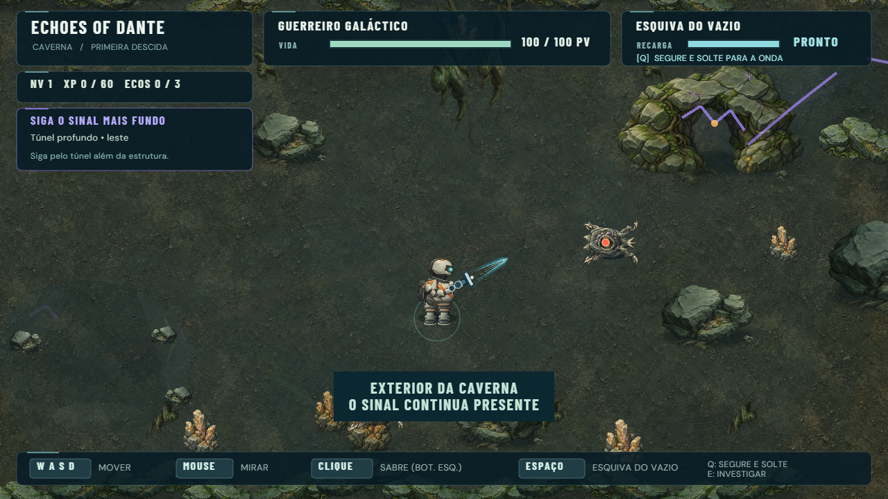 | 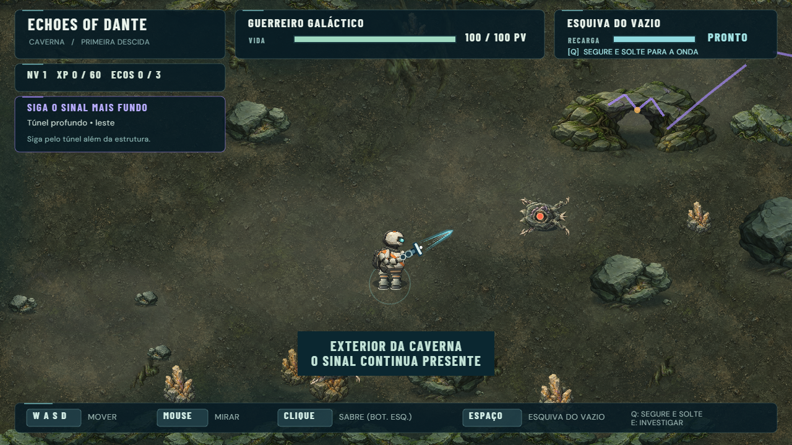 |
| Deep Cavern | 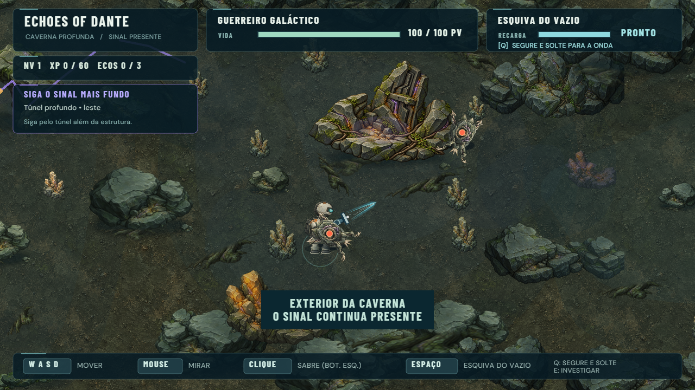 | 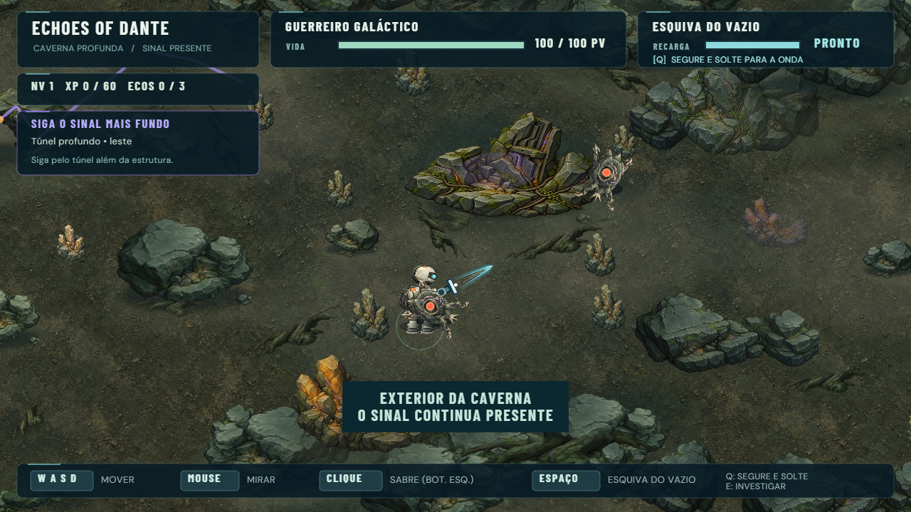 |
| Exterior | 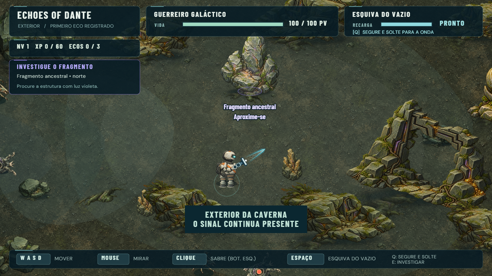 | 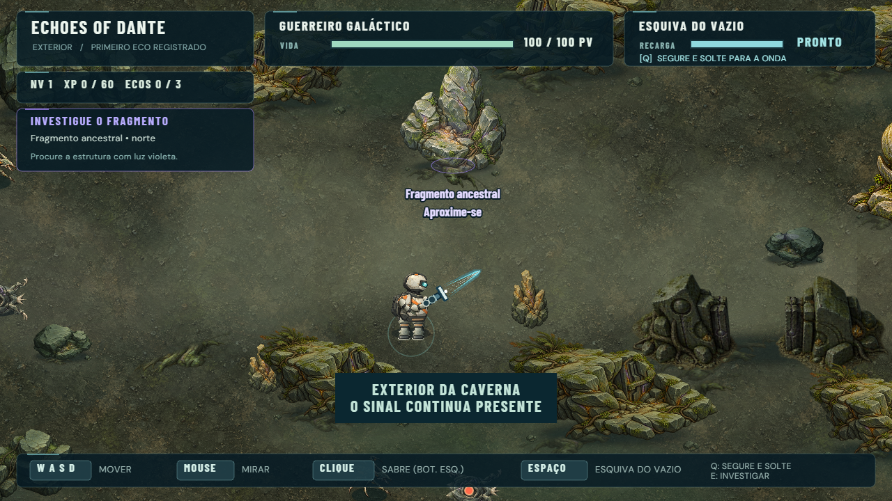 |
| Aproximação | 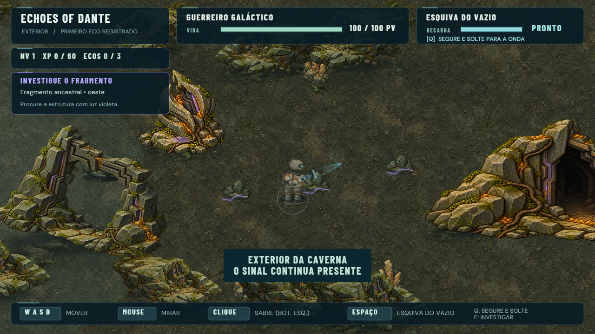 | 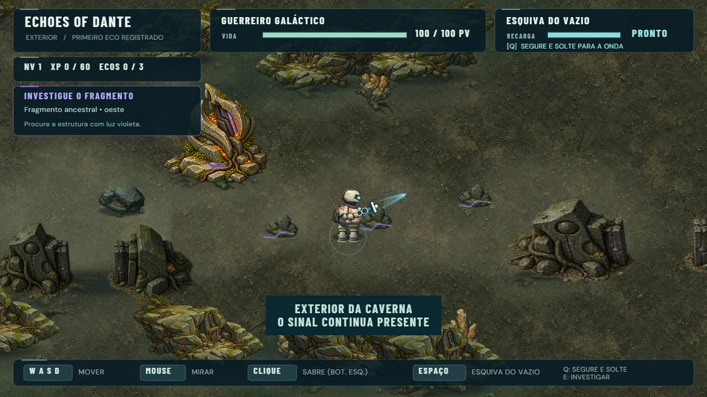 |

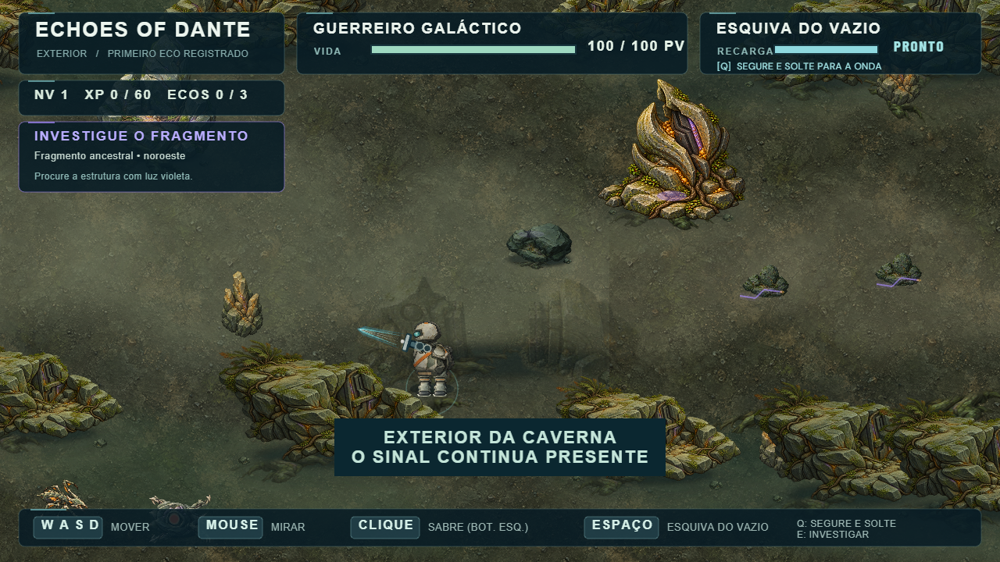

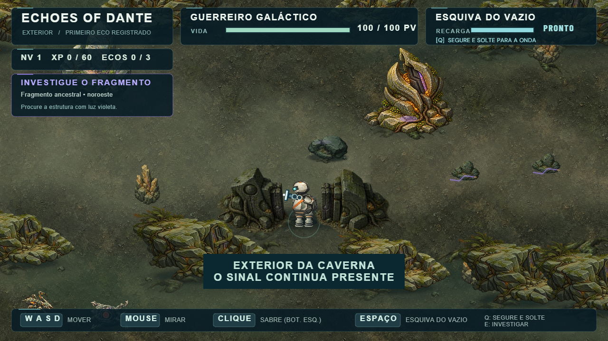

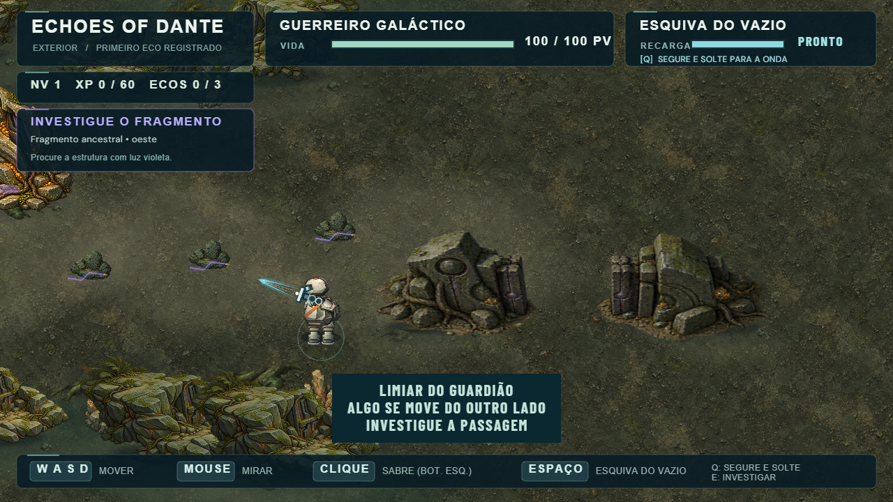

## Assets e preparo

Todos os assets de pedra, minerais, raízes, solo, personagens e POIs foram
reutilizados. As pinturas antigas dos portões permanecem no repositório.

| Novo arquivo | Resolução | Bytes |
| --- | --- | ---: |
| `guardian-lintel-closed.png` | 512×256 RGBA | 190.102 |
| `guardian-lintel-open.png` | 512×256 RGBA | 162.762 |
| `terrain-blend.png` | 256×256 RGBA | 10.555 |

Total: 363.419 bytes, cerca de 355 KiB; texturas decodificadas somam 1,25 MiB.
Os limiares vieram de uma geração original com `imagegen` integrado, sem asset
externo. [Prompt e origem](asset-origin.json). `prepare-grounded-threshold.py`
separa os dois estados com escala comum, sem perder alpha, usando Pillow offline.
`generate-terrain-blend.py` cria somente uma máscara técnica branca de alpha;
não gera ilustração, geometria ou cenário durante gameplay.

```powershell
python scripts/prepare-grounded-threshold.py caminho/do/original.png
python scripts/generate-terrain-blend.py
```

## Execução

Os três PNGs carregam no cache de texturas do Phaser. Sedimento e contato entram
nas RenderTextures existentes e o pool de stamps é destruído ao terminar o bake.
Não há objeto, tween, listener ou RenderTexture adicional na cena. A pequena
cache de raízes aumenta de 230×295 para 330×325 para não cortar a pintura.
Isso acrescenta aproximadamente 155 KiB de superfície RGBA, antes de buffers do
renderer. A grade de oclusão usa 1 KiB por textura elevada, em CPU.

## Verificação e limites

Relatórios nesta pasta registram verificações em Chrome headless com posições
DEV e entradas reais de teclado/mouse, touch emulado e gamepad mock. Não houve
validação física em iPhone ou controle real nesta revisão.

- `qa-environment-cohesion.mjs ... grounding-revision`: compara arrays físicos,
  limites, zoom, objetos/tweens e piso opaco com a base 0.1.40.
- `qa-ground-occlusion.mjs`: apoios atenuam quando encobrem o ator, vão vazio
  preserva opacidade, quatro resoluções e três reinícios estáveis.
- QA existente: percurso Forest → Ecos → fissura → Cavern → Deep → exterior,
  Primeiro Eco, abertura real do limiar, combate, morte/respawn e Warden.
- Build de produção: carregamento dos 13 assets monitorados e ausência de erros.

### Resultados executados

| Verificação | Resultado |
| --- | --- |
| Typecheck / build | Passaram; aviso preexistente do tamanho do chunk Phaser |
| Seis regiões | Arrays físicos, limites e zoom idênticos; zero aumento de objetos/tweens |
| Oclusão | Apoios, restauração, vão vazio, quatro resoluções e três reinícios passaram |
| Percurso | Forest, 3 Ecos, mecanismo, Cavern, Deep, exterior, combate/XP, retorno e respawn passaram |
| Primeiro Eco | Resposta única, portão fechado/aberto, três mortes, touch e gamepad mock passaram |
| Warden | Intro, três mortes, reinício limpo, vitória única, retorno, touch e gamepad mock passaram |
| Produção | 13 assets carregados, hook DEV ausente e zero erros |

As resoluções exercitadas foram 1280×720, 1366×768, 1920×1080 e 844×390.
Amostra aquecida do percurso: **58,97 FPS** médios (56,67–59,52); preparação:
**60,15 FPS** médios. Capturas curtas de startup ficam em torno de 50–55 FPS,
também observado na base; não representam a taxa estabilizada.
Os reinícios mantiveram 210 objetos, oito caches, quatro tweens e listeners
constantes na Cavern, e 72 objetos/uma cache na tentativa do Warden.

Um ensaio inicial do QA de intro do boss cruzou o limite temporal da apresentação
e detectou um golpe de 34 HP já após a proteção. A repetição integral, sem alterar
IA/combate nem enfraquecer o teste, passou. O ensaio de oclusão também foi ajustado:
o novo vão vazio corretamente não acionava a expectativa retangular antiga;
o teste agora distingue vão transparente e apoio pintado.

**Automação não aprova a estética. Playtest humano necessário.** Revisar
especialmente a escala das passagens, piso nas bordas, encaixe das bases e
clareza do corpo/ataques ao contornar pilares. A pintura mantém iluminação fixa;
o solo ainda repete uma textura pequena e a oclusão é uma aproximação amostrada.
O objetivo da revisão é reduzir a sensação de colagem; não declarar esse problema
definitivamente resolvido sem o usuário percorrer o trecho.
