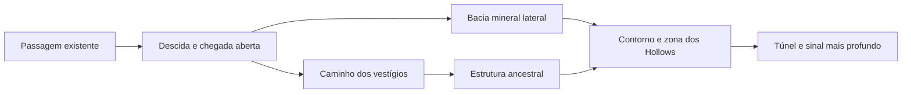

# Expansion Sprint 01 — Deep Cavern

**0.1.34**, sobre a base 0.1.33. Objetivo: converter o bolso profundo em uma pequena região explorável, seguindo Organic Sci-Fi R3, World Shape Language e a pintura D aprovada. Não implementar The First Echo.

## Experiência e composição

Antes: passagem revelada, bolso subterrâneo e uma estrutura, sem moradores ou escolha clara de percurso. [Captura anterior](before-deep.png).

Agora: cerca de **785 unidades** entre o desabamento em x=1715 e o limite profundo; os bounds e o modelo de câmera existentes continuam. A expansão é de conteúdo e composição, dentro da área já disponível.



- **Descida:** estreitamento, pedra mais fria, raízes esparsas e sinal existente nas paredes. A passagem abre pelo mesmo gatilho de proximidade, sem botão, chave ou combate obrigatório.
- **Chegada:** espaço para observar o ambiente e escolher o trajeto. O subtítulo identifica `DEEP CAVERN / SIGNAL PRESENT`.
- **Bifurcação:** uma rocha separa o caminho ancestral do desvio de crescimento mineral âmbar. Os trajetos se reencontram; é possível percorrê-los e retornar.
- **Conflito:** dois Hollows habitam locais distintos. Podem ser combatidos ou evitados; o final foi alcançado no teste mantendo os quatro Hollows da Cavern vivos.
- **POI:** grande estrutura com superfície intencionalmente construída, canais deslocados, fraturas, raízes e mineralização. Aproximação provoca uma resposta curta e reutiliza `ANCIENT PATTERN / SOURCE: STILL BELOW`. Sem nova interação, Echo ou recompensa.
- **Continuação:** estratos enquadram um recesso escuro com vestígio enterrado e Signal localizado. Aproximar-se apresenta `SIGNAL: DEEPER / PATH: UNCHARTED`. O trecho além do limite ainda não é jogável.

[Vista atual](after-deep.png) · [Desvio](side-route.png) · [POI](poi.png) · [Continuação](continuation.png) · [Touch emulado](touch-deep.png)

## Assets e renderização

Três pinturas originais complementam o kit existente:

| PNG em `public/assets/visual/environment/` | Dimensões | Função |
| --- | --- | --- |
| `deep-stratum.png` | 512×256 | Massas rochosas contínuas, bordas e enquadramento |
| `deep-mineral.png` | 512×384 | Formação integrada da bacia mineral |
| `deep-relay.png` | 448×512 | POI ancestral com fabricação exposta e erodida |

Total: **741.542 bytes (~724 KiB)**. Gerados com a ferramenta integrada `imagegen`, tendo o kit D aprovado como referência. O POI recebeu uma edição direcionada para distinguir construção ancestral de rocha natural. [Prompts e fontes](art-sources.json), [dimensões, tamanhos e hashes](asset-measurements.json).

`scripts/prepare-deep-cavern-art.py` recorta alpha e redimensiona offline. Os PNGs são versionados; os originais gerados permanecem na pasta local da ferramenta, identificados no manifesto. Não há download de arte externa ou geração de pintura em runtime.

`DeepCavernArt.ts` compõe a região uma vez: ground masses servem apenas como base/máscara; formações físicas são Images/texturas pintadas. `EnvironmentPainter` reutiliza e destrói o pequeno pool de imagens após o bake. A região conserva seu cache principal de 1000×850 e acrescenta somente um foreground de 430×155. Não há redraw do cenário por frame.

## Física, inimigos e estado

- Quatorze bases circulares adicionais: estratos, rocha de bifurcação, mineral, limite e formação do foreground. Somam-se à estrutura de obstáculos existente; não há objetos de física criados continuamente.
- Os pequenos minerais anteriores foram mantidos nos pontos da auditoria de colisão, para que seus footprints não virem bloqueios invisíveis.
- O teste encontrou um estreitamento na primeira composição; a rocha divisória foi afastada da base do POI. Navegação principal, desvio, retorno e aproximação do POI passaram após o ajuste.
- Dois novos Crawlers usam a classe, valores e patrulhas já existentes. Seus IDs de recompensa são 10 e 11, separados dos spawns anteriores. Só são criados depois da passagem profunda abrir; isso impede que o clamp os leve à primeira sala fechada.
- Derrotas concedem os mesmos 15 XP. Repetir a derrota do mesmo spawn após respawn não duplica XP. Nenhuma recompensa especial, novo nível ou recurso foi criado.
- Entrar em x≥1850 registra um retorno local de sessão em **(1870, 580)**, livre de obstáculos e fora do alcance inicial dos moradores. Morte restaura HP e preserva XP, nível, Echoes, POI visto, continuação percebida e passagens abertas. Se morrer antes de alcançar a região, o retorno da primeira Cavern continua.

## Signal, áudio e lore

O Signal cresce por composição: indício na descida, mineral lateral, presença no POI e iluminação contida no limite. Três luzes pequenas compartilham um único tween ambiente; a resposta do POI reutiliza o carrier da passagem com tween finito.

Música da Cavern e SFX `ancient`/`signal` são reutilizados. Nenhuma nova infraestrutura, faixa ou sistema sonoro. Violeta/âmbar pertencem ao mundo; ciano continua reservado ao jogador.

The First Echo é preparado apenas pela estrutura exposta e pelo sinal que continua. A identidade do sinal, de seus construtores, do Warden e a relação com a humanidade não são explicadas.

## Testes técnicos

`npm run typecheck` e `npm run build` passaram. Permanece o aviso já existente de tamanho do chunk Phaser; não houve novo aviso crítico.

Chrome headless, com setup DEV para aproximações da Forest e eventos reais de teclado/mouse para interação, travessia profunda e combate:

- Forest → 3 Echoes/120 XP → fissura → mecanismo → Cavern → passagem profunda.
- Travessia da descida, caminho lateral, zona dos moradores, final e retorno ao POI/primeira sala, sem eliminar Hollows.
- Colisão na rocha divisória, mineral, base do POI e limite; Dash contra o obstáculo.
- LMB, Q hold/release, dano, derrota e XP. Morte, HP restaurado, retorno seguro, estado preservado e nova travessia.
- Repetir a derrota do spawn já recompensado não altera XP.
- Gamepad API mock: movimento, mira e hold/release; touch Chrome emulado: movimento, STRIKE direcional, CHARGE e Dash.
- Viewports 1280×720, 1366×768, 1920×1080 e 844×390.
- Espera e três reinícios com população equivalente: objetos, texturas, tweens e listeners de input estáveis.
- Sem erros JS/console ou respostas HTTP de assets com erro no relatório do teste.

[Antes](before-measurements.json) · [Resultado](after-measurements.json). QA existente de regressão também executado; resultados em [regression/](regression/).

A build de produção também abriu sem erros: canvas visível, três pinturas profundas carregadas e inputs de movimento/ataque/Dash/carga enviados. Esse smoke não usa hooks DEV e verifica carregamento e erros; as afirmações de estado do fluxo completo são da execução de desenvolvimento. [Verificações complementares](supplemental-checks.json).

```powershell
npm run typecheck
npm run build
node scripts/qa-deep-cavern.mjs http://localhost:5174/ after
node scripts/qa-environment-art.mjs http://localhost:5174/ - docs/expansion-deep-cavern/regression
npm run preview -- --port 5175
node scripts/qa-deep-cavern-smoke.mjs http://localhost:5174/ http://localhost:5175/
```

Playwright e Chrome precisam estar disponíveis localmente; não foram adicionadas dependências. O projeto não configura `npm test`.

## Performance

Comparação com câmera/resolução equivalentes e amostragem de quatro segundos após estabilizar: **59,7 FPS antes**, aproximadamente **60,1 FPS depois**. Essas amostras usam moradores congelados para comparação do render; não certificam desempenho em todo hardware.

Uma medição complementar com **quatro Hollows vivos e IA ativa**, na região profunda, registrou **59,6 FPS médios** (59,2–60,1). O startup nos testes funcionais ficou entre aproximadamente 2,5 e 2,7 segundos. Chrome headless nesta máquina; não é uma certificação para dispositivos móveis.

Cena da Cavern com população completa: **66 → 79 objetos raiz**, **48 → 51 chaves de textura**, **3 → 4 RenderTextures**, **3 → 3 tweens ambientes**. O acréscimo vem dos dois Crawlers, duas pequenas luzes e um cache de foreground. Filhos dos containers não entram na contagem de objetos raiz.

Sem crescimento contínuo nos reinícios. Cenário permanece baked; câmera, zoom, controles, Player, combate, valores, IA e progressão não foram reescritos.

## Validação visual e limitações

Capturas reais do Chrome foram inspecionadas para conferir composição, material, caminho, POI e legibilidade. **Automação passou; playtest humano necessário.** Nenhum teste físico em PC interativo, iPhone ou gamepad foi realizado nesta expansão.

Verificar manualmente:

1. A descida parece levar a uma região nova?
2. A bifurcação chama atenção sem marcador ou instrução?
3. Combater ou contornar os dois moradores é confortável?
4. O POI parece uma construção antiga integrada à geologia?
5. O final desperta vontade de seguir, e o respawn não interrompe a experiência?
6. Navegação e leitura continuam confortáveis no iPhone e no gamepad reais?

A IA mantém perseguição direta; pode prender-se em obstáculos fora dos percursos abertos. Não há pathfinding novo. O limite ainda não abre outro capítulo, o POI não tem interação formal e todo progresso continua restrito à sessão da aba. Não há boss, quest, loot, save ou lore definitiva.
