# Expansion Sprint 02 — Deep Cavern → Cavern Exterior

**0.1.35**, base aprovada 0.1.34 / `ea8a43b`. A continuação preserva a região anterior e estende seu túnel para uma travessia com ameaças distintas, espaços de silêncio, escolha de percurso e uma saída para o ar livre. O Warden e The First Echo permanecem fora desta sprint.

## Estrutura espacial e ritmo

```mermaid
flowchart LR
    A[Deep Cavern aprovada] --> B[Túnel existente]
    B --> C[Apresentação dos Skitters]
    C --> D[Primeira combinação com Spitter]
    D --> E[Desvio mineral e respiro]
    E --> F[Vestígios e grupo misto]
    F --> G[Ascensão e maior concentração]
    G --> H[Exterior iluminado]
    H --> I[Fragmento investigável]
    I --> J[Aproximação monumental]
```



- A nova Cavern ocupa aproximadamente x=2470–4370; o exterior ocupa x=4370–5350, cerca de **980 unidades**. Todos continuam na mesma `GameScene`, fisicamente conectados. Não há loading de outra cena ao sair.
- O antigo limite horizontal é estendido depois da mesma abertura profunda. Uma base do antigo limite passa à borda superior do túnel; as demais formações, POI, bifurcação e moradores da Deep Cavern aprovada continuam.
- Bacias de larguras diferentes, rochas centrais, estratos e um contorno mineral inferior quebram o corredor único. O jogador pode avançar, desviar, combater e retornar. Não há porta por kill count, item, XP ou nível.
- A pedra fria e os vestígios dominam o subterrâneo. Na subida, a paleta abre para pedra clara, vegetação esparsa, ar e um vale distante pintado. O exterior é um platô rochoso; não repete as árvores e clareiras da Forest.
- Um arco ancestral incompleto enquadra o sinal além do limite. Não é uma boss arena acessível, não apresenta criatura distante e não identifica o Warden.

## Encontros e moradores

| Habitat | Composição | Função |
| --- | --- | --- |
| Apresentação | 2 Skitters | Aprender a investida curta |
| Primeira combinação | 1 Spitter + 1 Crawler + 1 Skitter | Pressão próxima e reposicionamento |
| Vestígios enterrados | 1 Spitter + 1 Crawler + 2 Skitters | Prioridades de alvo em espaço maior |
| Ascensão | 1 Spitter + 2 Crawlers + 1 Skitter | Maior composição antes da saída |
| Borda exterior | 1 Crawler + 1 Skitter | Ameaça localizada, com centro livre |

São **15 novos moradores**: 7 Skitters, 3 Spitters e 5 Crawlers. Com os 4 anteriores, o máximo ativo na Cavern completa é 19. Os habitats são instanciados uma vez por ciclo de cena, pouco antes da aproximação; retornar não gera outro grupo. A morte/respawn recria os moradores como já ocorria com os Hollows, mas conserva IDs de recompensa.

### Skitter

Criatura estreita, articulada, de membros longos e carapaça viva. Aproxima-se mais rápido que o Crawler. Um marcador alongado anuncia a direção fixa da investida; é possível esquivar e interromper sua preparação com dano.

| HP | Raio | Velocidade | Detecção | Alcance de início | Dano | Cooldown | Preparação | Investida |
| --- | --- | --- | --- | --- | --- | --- | --- | --- |
| 42 | 14 | 175 u/s | 280 | 60 | 9 | 1150 ms | 320 ms | 310 u/s por 140 ms |

Cada investida aplica dano no máximo uma vez e usa `moveWithCollisions`. Sua direção não acompanha o alvo durante a execução.

### Spitter

Criatura larga, de tecido e carapaça, com bolsa dorsal âmbar. Mantém distância, recua quando o jogador chega perto e prepara um disparo biológico. A linha âmbar de preparação indica a direção comprometida; reposicionar-se evita o projétil.

| HP | Raio | Velocidade | Detecção | Alcance de início | Recuo | Dano | Cooldown | Preparação |
| --- | --- | --- | --- | --- | --- | --- | --- | --- |
| 85 | 22 | 65 u/s | 390 | 300 | abaixo de 150 | 10 | 2300 ms | 700 ms |

Projétil: 240 u/s, alcance máximo 520, raio 7. Cada Spitter possui **um único objeto reutilizado**; contato, obstáculo, limite, morte do jogador ou morte do próprio inimigo encerra o disparo. `inShockwaveSweep` verifica o trecho percorrido para não saltar o alvo entre frames. Obstáculos bloqueiam o projétil; não há novo sistema global de projéteis.

### Integração e XP

`Enemy` descreve o contrato que o combate já consome: posição, raio, Health, update, reação e morte. `DanteCreature` contém os dois comportamentos explícitos. O Crawler continua usando sua classe e valores anteriores, sem refactor de IA. Sabre, onda, HP base, Dash, controles e progressão não mudam.

Todos recebem os mesmos **15 XP por spawn** através de `Progression.defeatHollow`. IDs 12–26 não colidem com Forest/Cavern/Deep Cavern. Não há XP por dano, recompensa especial, níveis adicionais, loot ou inventário. Os números são iniciais e precisam de playtest de balanceamento.

## Fragmento, Signal e preparação narrativa

O vestígio exterior em (4870,620) permite `E` / `A` / INVESTIGATE ao aproximar-se. A resposta é curta, sem pausa de controle:

```text
TRANSMISSION FRAGMENT
PATTERN: REPLY
```

Essa informação sugere que o padrão contém uma resposta de transmissão. Não nomeia seus construtores, confirma origem humana, explica Dante ou revela a identidade do Signal. Um brilho violeta muda no vestígio e no limite. O registro é local à sessão; não concede XP nem um quarto Echo.

Perto da aproximação final:

```text
MONUMENTAL TRACE
SOURCE: BEYOND
```

O objetivo usa os módulos existentes: seguir o Signal, investigar o fragmento e seguir a resposta. O arco, a escala e o sinal preparam um encontro futuro; nenhum boss, ataque de boss ou detalhe de lore do Warden foi criado.

## Assets e cache

Cinco pinturas originais, criadas com a ferramenta integrada **imagegen** e referências do kit D aprovado. [Prompts/fontes](art-sources.json) e [dimensões, tamanhos e hashes](asset-measurements.json).

| Asset | Dimensão | Runtime |
| --- | --- | --- |
| `characters/dante-skitter.png` | 256×256 | Image dentro da entidade |
| `characters/dante-spitter.png` | 256×256 | Image dentro da entidade |
| `environment/exterior-outcrop.png` | 512×384 | Pintura integrada ao bake |
| `environment/ancient-approach.png` | 512×512 | Uma Image de foreground para oclusão do monumento alto |
| `environment/exterior-atmosphere.png` | 512×512 | Uma Image de fundo distante |

Total: aproximadamente **1,19 MiB**. `scripts/prepare-expansion-art.py` recorta alpha e normaliza offline. A atmosfera preserva o canvas e o fade alpha à esquerda, editado com imagegen para integrar cavern/air sem borda retangular. Os PNGs finais ficam em `public/assets/visual/`; não dependem da pasta local de imagens geradas para jogar.

`CavernContinuation` compõe três tiles estáticos de **1000×1000** uma vez, reutilizando `EnvironmentPainter`. Solo/máscara usa Graphics apenas no bake; rochas, estruturas, minerais e vegetação são pinturas. O pool de Images de composição é destruído ao terminar. Não há geração de arte, redraw do cenário ou novos detalhes DOM por frame.

Uma única animação ambiente atende as pequenas luzes adicionais. Marcadores de ataque e projéteis são objetos reutilizados; a resposta do fragmento é um tween finito. A extensão de bounds acompanha o novo mundo; zoom, follow e modelo de câmera permanecem.

## Colisão e respawn

Os dados em `config/expansion.ts` compartilham posições de formações e footprints. Há 26 bases de estratos e 24 bases de rocha/estrutura/mineral: **50 círculos adicionais**. Vegetação baixa, pequenas raízes e detalhes permanecem atravessáveis. A composição complexa não se traduz em colisão pixel-perfect.

Retornos locais de sessão:

- Antes da continuação: retorno da Deep Cavern aprovada.
- Após alcançar a continuação: **(2580,980)**, pequeno contorno inferior seguro próximo à entrada.
- Após alcançar o exterior: **(4600,740)**, centro livre fora da detecção inicial dos moradores.

HP restaura, XP/nível/Echoes persistem, a passagem permanece aberta e o fragmento continua registrado. Recarregar a aba começa uma nova sessão. Não há checkpoint framework, save ou recompensa duplicada por matar novamente um spawn.

## Áudio

Reutiliza a faixa Cavern no subterrâneo e Forest no exterior. Voltar ao subterrâneo restaura a faixa Cavern. O AudioManager mantém uma música por vez e reutiliza os SFX de Signal/tecnologia antiga. Sem nova infraestrutura, faixa, voz ou lore cantada.

## Validação

Os comandos e os relatórios do Chrome ficam nesta pasta:

```powershell
npm run typecheck
npm run build
node scripts/qa-cavern-exterior.mjs http://localhost:5176/
node scripts/qa-cavern-exterior-combat.mjs http://localhost:5176/
node scripts/qa-environment-art.mjs http://localhost:5176/ - docs/expansion-sprint-02/regression
npm run preview -- --port 5175
node scripts/qa-cavern-exterior-production.mjs http://localhost:5175/
```

QA usa hooks DEV para aproximar locais e isolar atores, eventos reais de teclado/mouse para travessia/combate e mocks de Gamepad API. A travessia usa invulnerabilidade de teste para confirmar acesso sem limpar os 19 moradores; o teste de dano usa ataques reais sem invulnerabilidade. Isso não certifica dificuldade ou conforto humanos.

Typecheck e build passaram; o build conserva o aviso anterior de tamanho do chunk Phaser. O projeto não configura `npm test`; os scripts QA utilizam Playwright/Chrome já disponíveis localmente, sem novas dependências.

[Relatório funcional](measurements.json): fluxo anterior completo, caminhos principal/lateral, retorno, fragmento uma vez/sem XP, investida de 9 de dano, disparo de 10 de dano, esquiva, bloqueio de projétil, mortes dos dois tipos, XP, rocha/Dash, morte/retorno seguro, não duplicação de XP, mock gamepad, touch emulado e quatro resoluções passaram. Três reinícios mantiveram objetos, texturas, RenderTextures, tweens e listeners estáveis. Sem erros JS ou de carregamento de assets.

[Combate misto](combat-checks.json): o LMB aplicou os mesmos 34 de dano a Spitter/Crawler/Skitter. A onda eliminou Spitter e Crawler; o Skitter se aproximou por dentro do início da onda e foi finalizado com melee. Total de 45 XP, sem modificar os valores ou forçar os três alvos a permanecer parados. A captura é de combate controlado, não um playtest humano.

[Regressão existente](regression/measurements.json) e [produção](production-checks.json) registram verificações complementares. O smoke de produção confirma canvas, assets e inputs sem erros e sem hook DEV; as afirmações completas de estado são da execução de desenvolvimento.

O campo `physicsUnchanged: false` da QA antiga indica que não foi fornecido um snapshot físico anterior para igualdade estrita; esta expansão acrescenta footprints e estende bounds intencionalmente. As verificações de colisão/Dash, entradas e navegação passaram. As amostras curtas daquela QA, tomadas logo após carregar/reiniciar a cena, ficam aproximadamente em 53–56 FPS; a medição dedicada abaixo espera estabilizar.

### Performance observada

Chrome headless nesta máquina: startup de aproximadamente **2,8–3,6 s**, **60,1 FPS** no exterior com 19 atores e IA ativa, **58,8 FPS** com combate ativo no trecho profundo. Amostras curtas após estabilização; não garantem o mesmo desempenho em dispositivos móveis.

Cena completa estabilizada: **178 objetos raiz**, **56 chaves de textura**, **7 RenderTextures**, **4 tweens ambientes**, um listener `pointerdown` e um `keydown`. Filhos de containers não entram na contagem raiz. Efeitos de acerto/passada continuam temporários; contagens transitórias podem ser maiores durante ação, sem crescimento contínuo.

### Capturas e playtest

[Exterior](view-1280x720.png) · [Fragmento](fragment.png) · [Aproximação](approach.png) · [Combate misto](mixed-combat.png) · [Combate profundo](deeper-combat.png) · [Touch emulado](touch-exterior.png).

**Playtest humano necessário.** O teste físico em PC, iPhone e gamepad não foi realizado nesta expansão. A aprovação manual anterior da Deep Cavern não é aprovação automática destes novos encontros.

Verificar no playtest: distinção dos dois novos tipos; leitura da preparação/disparo; ritmo e descanso entre grupos; conforto do desvio mineral; mudança perceptível para o ar livre; segurança do retorno; força da pista narrativa e vontade de seguir além do arco.

## Limitações e próximos passos

- Perseguição direta, sem pathfinding. Criaturas podem prender-se em obstáculos; o Spitter pode disparar contra cobertura em vez de encontrar outra linha de tiro.
- Encontros, silhuetas e valores são iniciais. Validar leitura da preparação, prioridade de alvos, possibilidade de kite e dificuldade dos grupos no PC/iPhone/gamepad reais.
- O exterior continua sem capítulo além do arco. Preparação monumental não implementa First Echo nem Warden.
- Próxima decisão após playtest: ajustar ritmo e preparar The First Echo/Warden Preparation, antes de qualquer boss.
