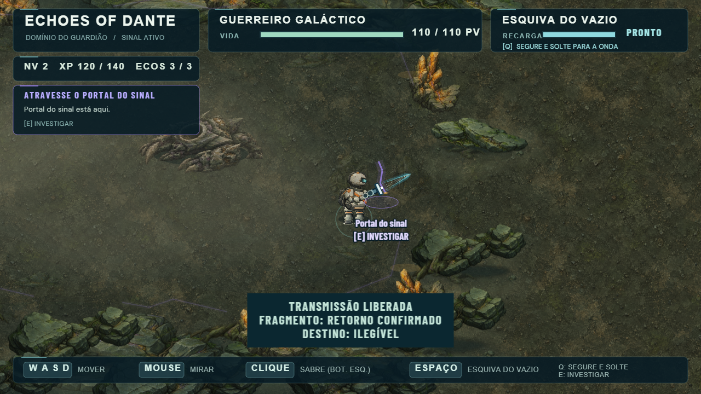
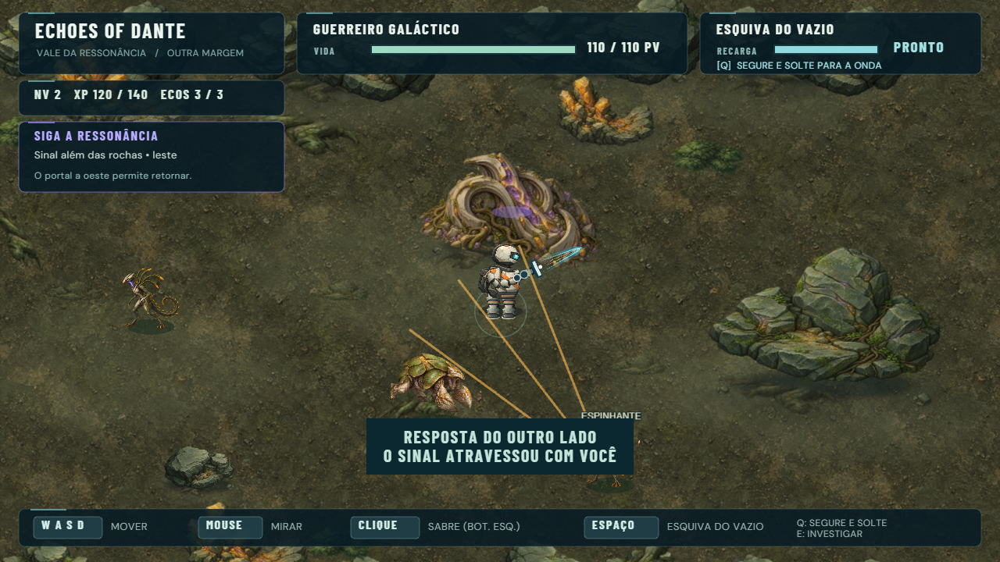
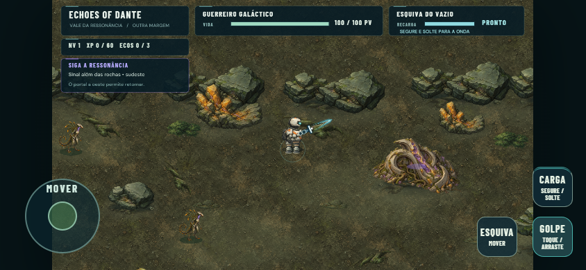

# Movimento touch e Vale da Ressonância — 0.1.42

> Registro da expansão original. Desde 0.1.44, reload preserva a jornada e os
> habitats do Vale renovam moradores por intervalo, sem resetar na morte.
> Consulte [Jornada persistente e expedições](../dante-journey/) para o comportamento atual.

Esta expansão incorpora a revisão de chão/limiares 0.1.41. D / Organic Sci-Fi R3
permanece: material raster, silhueta, sombra curta, transição com sedimento e
raízes. Forest, Cavern e o encontro do Warden mantêm seus valores e rotas.

## Como jogar

Derrote o Warden. Após sua queda, a transmissão revela uma fenda violeta na
parte leste da arena. Siga **ATRAVESSE O PORTAL DO SINAL**, aproxime-se e use
E, A do gamepad ou o botão contextual touch. A travessia preserva HP atual,
nível, XP, Ecos e Primeiro Eco. O portal de chegada a oeste permite voltar;
o Warden não reaparece depois da vitória na mesma sessão.

No mobile, inicie o movimento na área ampla à esquerda, mesmo fora do círculo.
A base se reposiciona. Continue arrastando além do círculo e até fora da área
inicial; somente soltar/cancelar interrompe o comando. Pressionar perto da borda
é neutro, sem deslocamento inesperado. O movimento mantém a velocidade atual;
golpe, esquiva e carga conservam seus gestos. Portrait solicita rotação.

## Região e ritmo

O vale é uma seleção de área própria, não uma cópia do exterior anterior.
Sua faixa navegável mede 2400×780 unidades e a câmera mantém zoom/follow atual.

1. Chegada quieta em (530,850), com fenda de retorno.
2. Primeiro Casco Errante e um caminho aberto entre formações baixas.
3. Desvio norte mineral com um Espinhante; rota sul permite avançar.
4. Encontro misto junto à crista central, com espaço para contornar obstáculos.
5. Crescimento ancestral em (2190,650), um POI investigável sem recompensa.
6. Habitats mais ao sul e passagem interrompida a leste, indicando outro sinal.

Nenhum caminho exige matar inimigos. A estrutura responde: **“O sinal atravessou
com você”**. Isso não define sua origem nem responde o registro humano.
O checkpoint local (1860,570), após avançar pelo meio do vale, evita reiniciar
toda a exploração e fica fora do alcance de detecção dos habitats de nascimento.
Morte restaura HP; flags de portal/POI e recompensas permanecem. Reload inicia
uma nova sessão, como no restante do jogo.

## Criaturas

| Arquétipo | HP | Velocidade | Ataque | Preparação / recuperação |
| --- | ---: | ---: | --- | --- |
| Casco Errante | 136 | 74 | Varredura frontal de 18 de dano; alcance 105 | 850 / 850 ms |
| Espinhante | 78 | 96 | Leque de três espinhos de 11; mantém distância | 950 / 700 ms |

São seis entidades, três de cada arquétipo. Avisos fixam a direção antes da
execução; sair da área evita o golpe. Espinhos respeitam obstáculos e a mesma
proteção curta contra dano consecutivo do Warrior. Saber, Charge, knockback e
XP usam o contrato Enemy existente: 15 XP por habitat, uma vez por sessão.
As poses mudam com deslocamento real e mantêm pés na mesma base; o corpo não
gira nem fica de cabeça para baixo ao mirar. Não há pathfinding novo.

## Arte, terreno e física

Pedra, raízes, minerais, vegetação baixa, sombras, solo e limiares reutilizam
o kit D. Novos assets originais: dois atlas de criatura e o crescimento ancestral.
[Prompts/origem](art-sources.json), [dimensões, bytes e hashes](asset-measurements.json).

| PNG | Dimensões | Bytes |
| --- | --- | ---: |
| dante-carapace-motion | 1024×512; oito frames 256×256 | 545.692 |
| dante-thorn-motion | 1024×512; oito frames 256×256 | 443.625 |
| resonance-growth | 512×384 | 256.499 |

Total: 1.245.816 bytes (1,19 MiB); superfícies RGBA decodificadas: 4,75 MiB.
Foram gerados com imagegen integrado, sem material externo, e preparados com
Pillow offline. `python scripts/prepare-valley-art.py pasta-dos-originais`
recorta alpha, preserva escala entre poses e coloca os pés na linha 244.
Phaser carrega os atlas por spritesheet e o POI por Image.

O piso contínuo cobre inclusive bordas das caches. Sedimento de bordas suaves,
raízes e detritos unem bases ao terreno. Rochas e POI usam footprints circulares
simples; 21 obstáculos estáveis delimitam bases e margens. Crescimentos minerais
rasos, fragmentos e vegetação baixa permanecem decorativos. Não existe colisão
por pixel. Apoios baixos do portal atenuam somente quando a pintura encobre o
Guerreiro, reutilizando a oclusão da revisão 0.1.41.

## Execução e performance

Duas RenderTextures de 1500×1200 capturam a composição ao criar a área, cerca de
13,73 MiB de superfícies RGBA antes de buffers do renderer. O pool temporário de
stamps é destruído após o bake. Dois tweens reutilizam pulso do POI e fenda do
portal. Cada Espinhante possui um pool fixo de três projéteis; não há geração de
arte, redesenho de cenário ou novos listeners por frame. Áudio reaproveita Forest
e os sinais existentes. As regiões anteriores não retêm objetos da cena após
a travessia, embora texturas carregadas permaneçam no cache do Phaser.

## QA e limites

Os relatórios `qa/report.json` e `touch-qa/report.json` registram Chrome headless
com setup DEV explícito, entradas reais e mocks. Não são testes físicos de iPhone
ou gamepad. O QA do percurso anterior cobre Forest → Ecos → fissura → Cavern →
profundezas → exterior; o QA de preparação/boss cobre Primeiro Eco e Warden.

O QA específico verifica desbloqueio por vitória, transferência de HP/progresso,
rotas principal/lateral sem mortes de inimigos, ataques, esquiva de aviso,
projéteis bloqueados, Saber/Charge, XP único, três mortes, checkpoint seguro,
retorno, reload e estabilidade. Exercita 1280×720, 1366×768, 1920×1080 e 844×390.
Touch testa 844×390, 960×540 e 1180×820, três reinícios, pressões nas bordas,
captura além da zona, multitouch, release/cancelamento, blur, orientação,
interação e gestos sem scroll/zoom. Produção verifica os 16 PNGs monitorados.

### Resultados executados

| Gate | Resultado |
| --- | --- |
| Typecheck e build | Passaram; aviso preexistente de tamanho do chunk Phaser |
| Percurso anterior | Ecos, mecanismo, Cavern, Deep, exterior, combate/XP, retorno e respawn passaram |
| Primeiro Eco | Interação única, estado após morte, abertura real do limiar e controles emulados passaram |
| Warden | Intro, três mortes, reinício limpo, vitória/transmissão únicas, retorno e reload passaram |
| Vale | Portal por vitória, seis criaturas, duas rotas sem eliminar inimigos, POI, ataques, XP único, morte/retorno/reload passaram |
| Touch | Área ampla, arrasto além da zona, toque neutro nas bordas, multitouch, cancelamento/orientação e gestos passaram |
| Produção | 16 assets monitorados carregaram; hook DEV ausente; zero erros |

Vale aquecido: **60,31 FPS médios** (59,93–60,47) na amostra de seis segundos;
105 objetos da cena, duas caches e dois tweens, constantes em três reinícios
e no período ocioso observado. Percurso anterior: 59,86 FPS; preparação: 59,93 FPS.
Contagens de texturas/listeners e uma única raiz touch permaneceram estáveis.
Esses números são do Chrome headless usado no ambiente de teste, não de iPhone.

Relatórios complementares estão em `regression/`. Ensaios iniciais do harness
foram corrigidos sem alterar gameplay: a morte era provocada ainda durante a
invulnerabilidade do Dash; a finalização parcial CDP indicava o dedo errado;
o percurso do retorno ao boss podia parar pela tolerância antes do limiar real.
Os testes completos foram repetidos e passaram depois dessas correções.

**Playtest humano necessário.** Revisar o controle no iPhone, naturalidade das
passadas, tamanho dos novos mobs, leitura dos avisos, contato do POI com o piso
e ritmo dos encontros. A perseguição direta pode encostar em obstáculos; não há
busca de caminho. O chão continua usando uma textura pequena repetida, com
transições baked para reduzir regularidade. A nova área tem um limite deliberado
de conteúdo; a passagem final ainda não transporta para outra região.

### Capturas

