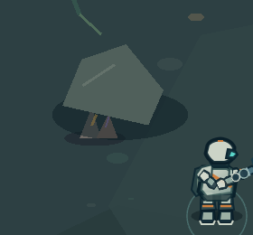
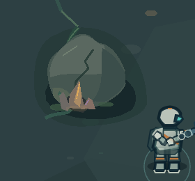

# Visual Prototype 02 — Cavern Organic Form Test

**Implementation complete; visual approval awaits human playtest.** Version 0.1.30.

**Subsequent human result:** the user did not approve the representation: it still
read as grouped geometric shapes. The original experiment is preserved as the
control for [Visual Rendering Prototype 01](../visual-rendering-prototype-01/).

## Find the experiment

Inside the first Cavern chamber, walk north and slightly east from the entry
(630, 950). The test is the rock/mineral grouping centered at **(885, 595)**,
west of the main path and before the ancient face. The authored visual patch is
approximately **180 × 170 world units**. The rest of the Cavern and all Forest
art remain unchanged.

This grouping was chosen because its original single faceted rock and two
triangular mineral pieces read as separate props. An existing root ends near its
rear edge, providing an opportunity to connect growth, stone and ground.

## Direct comparison

Both captures use 1280×720, zoom 1, camera scroll (310, 300) and player position
(1000, 690). Enemy updates are frozen only in capture setup to isolate the artwork.
The detail images are crops of the same framing, without enlargement.

| Before — 0.1.29 | Prototype — 0.1.30 |
| --- | --- |
|  |  |

Full frames: [before](before.png), [after](after.png).
Measurements: [comparison.json](comparison.json).

## Applied shape language

- **Rock:** one uneven silhouette with a cap, unequal shoulder and low foot.
  Broad material fields and a single broken fracture replace the isolated block.
- **Wall / geology:** the experiment uses a local outcrop, not a wall redesign.
  Its rear mass and low soil apron establish contact; surrounding walls remain
  exactly as authored before the test.
- **Roots:** growth continues from the existing root endpoint, disappears under
  the stone and reappears at its base. The root connects surfaces instead of
  adding unrelated lines.
- **Minerals:** unequal faceted pieces emerge from the same fracture, partly
  buried in a shared pocket. Amber and violet emission remain small and baked;
  Mineral Pulse and all gameplay VFX are untouched.
- **Depth:** quiet soil/contact shadow behind the mass, broad stone surfaces in
  the middle, and selective growth/mineral overlap at the foot. These are visual
  layers within the existing bake, without additional RenderTextures.
- **Ancient / human technology:** neither occurs inside this selected grouping.
  The ancient face, inscriptions and other structures were not redesigned. No
  new technology, lore, interaction or reward is introduced.

These choices apply the existing [World Shape Language](../WORLD_SHAPE_LANGUAGE.md)
and [Organic Sci-Fi R3 Art Bible](../art-bible/). They do not define a new palette
or visual direction.

## Physics and isolation

The original rock circle remains at (885, 595), radius 56. All obstacle data and
area bounds match the pre-test snapshot exactly. Raised stone stays around that
footprint; its wider contact apron and thin roots are low, traversable material.
The small mineral seam remains non-solid under the previous classification.

`src/visual/OrganicCavernForm.ts` draws only this patch into the existing static
Graphics before baking. `CavernArea.ts` delegates only the selected rock and skips
its previous mineral seam drawing. To restore the prior composition, remove the
delegate branch, the seam skip and the import; the original rock/mineral drawing
code is retained. No physics or gameplay rollback is required.

## Verification performed

**Automation passed. Human playtest required.**

- Typecheck and production build passed; the existing large Phaser chunk warning
  remains.
- Chrome loaded Forest; real E inputs investigated all three Echoes and opened
  the original mechanism. Walking through the fissure entered Cavern.
- Chrome exercised eight movement directions, rock contact, movement around the formation,
  Dash contact, LMB damage (34), stationary charge/release, Hollow damage/death,
  XP, Player death and safe Cavern respawn. Progress and passages persisted.
- The existing deep passage and signal remained functional. Setup positions and
  temporary invulnerability isolated accessibility checks; combat was separately
  tested with damage enabled. This is automation, not a human route playtest.
- Keyboard/mouse, standard Gamepad API mock and multi-pointer touch emulation
  exercised combat and movement around the rock. No controls were modified.
- Desktop 1280×720, 1366×768, 1920×1080 and touch 844×390 were checked.
- At the same capture position, five-second samples averaged **57.3 FPS before**
  and **57.1 FPS after**. Both had **66 scene objects, 3 RenderTextures and 3
  tweens**. Object/Graphics/tween counts remained stable during the idle check.
- No JavaScript errors were reported in the successful gameplay/input runs.
- Captures were visually inspected; no physical iPhone or gamepad test was
  performed in this environment.

## Human decision

Play this one grouping in the current build. Compare its silhouette and ground
contact with the unchanged neighboring formations, including while a Hollow is
nearby. Check that roots and low soil look traversable and the main stone looks
solid. Decide whether the grouping feels formed in Dante, while player, threat
and path remain easy to read.

No expansion to walls, the ancient face, the deep area or Forest is approved by
this experiment. Authenticity and comfort remain a user playtest decision.
