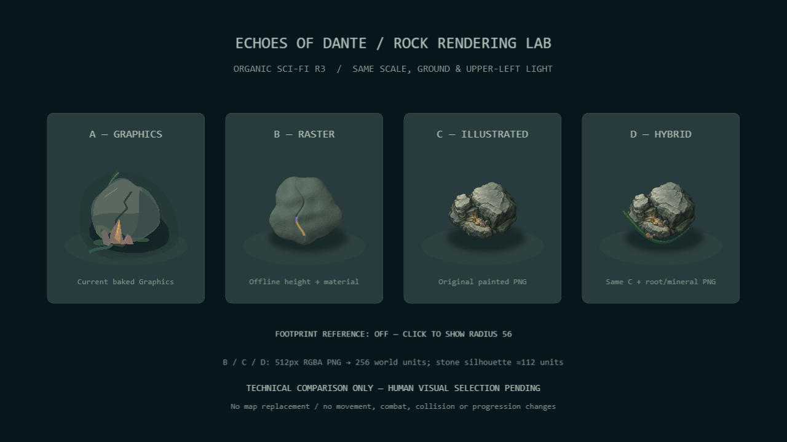

# Visual Rendering Prototype 01 — Rock Rendering Lab

**Isolated experiment, version 0.1.31. D approved by the user as the visual reference.**


**Current world integration:** the user approved beginning with Cavern and Forest.
See the [0.1.32 environment art pass](../environment-art-pass/) for the live-game
application and comparisons. This document retains the historical experiment.

## Human visual decision

After viewing the comparison, the user selected **D — Hybrid**: "D é de longe o
melhor! todo o estilo do jogo deveria ter a pegada desse estilo do D".

The target representation is an **illustrated raster asset with material,
volume, contact shadow and selective environmental overlap**. This validates
the rendering language, not a requirement to repeat the same rock everywhere.
Organic Sci-Fi R3 and World Shape Language remain authoritative.

Apply that treatment with distinct materials: nature grows irregularly;
ancient technology is weathered and integrated; human equipment retains its
functional, industrial construction. Shared paint/shading should unify those
families while preserving their different silhouettes and semantic colors.

The lab, captures and measurements below describe the original comparison.
No map or character substitution has been made by this decision record.
Expansion scope is being defined separately; gameplay, physics, controls,
camera, HUD behavior and audio must remain intact.

## Problem and hypothesis

The user tested Visual Prototype 02 on PC and rejected its perceptual result:
the formation still looked like grouped geometric shapes. Its technical tests
passed, but composing more Graphics did not resolve the representation problem.
The existing prototype and all map artwork remain intact.

Hypothesis: one illustrated/material raster texture can communicate a stone
surface and volume at gameplay size more effectively than replayed polygon
surfaces. World Shape Language and Organic Sci-Fi R3 remain authoritative.

## Open the lab

Run `npm run dev`, then open **http://localhost:5173/rendering-lab.html** (use the
port printed by Vite). The same path is included in `npm run build`; preview it
with `npm run preview`. On a hosted build, append `rendering-lab.html` to its base
URL. The normal game remains at `/`; there is no lab activation in gameplay.

Four columns share the same floor, framing, upper-left lighting intention and
contact-shadow texture. The stone width is approximately 112 world units.
Organic silhouettes and aspect ratios are preserved rather than forced into an
identical pixel mask. The lab camera is fixed at zoom 1. The normal game's camera
is untouched. Click the footprint label to compare a radius-56 circle; it is a
diagnostic drawing, not new gameplay physics.



## Strategies

| Version | Authoring | Runtime visual unit |
| --- | --- | --- |
| A — Graphics | Exact current `drawOrganicCavernForm`, without refinement. | One 256×256 RenderTexture baked once from the existing Graphics commands. |
| B — Raster | Offline sampled height field, normal-based shading, continuous pigment/grain, curved fracture and small mineralized seam. No polygon rasterizer. | One Image using `rock-raster.png`. |
| C — Illustrated | Original imagegen illustration, weathered stone, painted volumes, unequal shoulder and shallow front mineral pocket. | One Image using `rock-illustrated.png`. |
| D — Hybrid | The **same C texture**, plus one tapering root/mineral overlay painted offline. | Two Images sharing C plus `root-mineral-overlay.png`. |

Every column has an Image using the shared `contact-shadow.png`. Its own surface
shading is already in the source asset. Material colors are subdued grey-green;
small amber/violet deposits use the existing mineral/mystery language. Player
cyan, lore, inscriptions, gameplay effects and interactions are not added.

## Assets and authoring

All four experimental PNGs live in `public/assets/experiments/rock-rendering/`.
Each is **512×512 RGBA with real transparent pixels** and displays at 256×256
world units, including substantial transparent padding around the stone.

| Asset | Size on disk |
| --- | ---: |
| `rock-raster.png` | 53,824 bytes |
| `rock-illustrated.png` | 81,158 bytes |
| `root-mineral-overlay.png` | 2,580 bytes |
| `contact-shadow.png` | 13,927 bytes |
| Total | 151,489 bytes (about 148 KiB) |

`scripts/generate-rock-rendering-prototype.py` generates B, the overlay and the
shadow **offline**. It uses Python/Pillow already available in the authoring
environment; Pillow is not a runtime or npm dependency. The sampled field uses
fixed spatial noise, so these outputs are reproducible:

```sh
python scripts/generate-rock-rendering-prototype.py
```

C was generated with the built-in imagegen tool, without third-party images,
downloads, samples or a copied game's assets. The original output was 1254×1254.
The [exact authoring prompt](illustration-prompt.md) is recorded. AI generation
is not deterministic. The committed normalized PNG is the selected prototype
artifact, not a final production asset.

To normalize a newly generated transparent illustration:

```sh
python scripts/generate-rock-rendering-prototype.py --illustration /path/to/original.png
```

Normalization crops by significant alpha, preserves the original aspect ratio
and alpha inside the crop, resizes the rock to at most 224×220 pixels, and places
it in the same 512×512 transparent canvas. Without that argument the script does
not overwrite C. No asset generation runs in the browser.

## Loading, isolation and future integration

`rendering-lab.html` imports its own small Phaser entry and scene.
`RockRenderingLab.preload` calls `load.image` for the four PNGs using Vite's
`BASE_URL`. Assets load once into Phaser's texture cache; C/D share a texture.
The scene has no update/render generation loop or tweens. The comparison floor
and A bake once, then their source Graphics are destroyed. The footprint drawing
is created once and its visibility toggled.

`vite.config.ts` includes the normal and lab HTML entry points in the **same web
build**. The normal entry never imports the lab scene and makes no experimental
asset requests. Forest/Cavern rendering, the previous microprototype, input,
HUD, audio, progression and physics code are unchanged.

Technically, **C's single reusable Image is the simplest candidate for a future
integration test**, while D costs one extra Image and demonstrates overlap.
Either can be stamped into the existing static bake with its independent simple
collider. This is the technical assessment from the comparison. The subsequent
human selection is **D**, as recorded above. No map substitution was made in the lab.

## Technical verification

See [measurements.json](measurements.json) for the actual Chrome results.

Five-second samples (25 readings, 1280×720; same Cavern camera/player setup):

| View | Base 0.1.30 FPS | Prototype 0.1.31 FPS | Scene objects after |
| --- | ---: | ---: | ---: |
| Normal Forest | 57.3 | 57.5 | 370, unchanged |
| Normal Cavern | 59.7 | 59.4 | 66, unchanged |
| Isolated lab | — | 59.3 | 25 |

The lab adds **zero objects, textures or tweens to the normal game**. Its separate
scene has 8 Images, 14 Text labels, 2 RenderTextures (1280×720 floor and 256×256 A)
and 1 static, normally hidden footprint Graphics. Four loaded PNG texture keys
are shared; label canvas textures also appear in Phaser's texture registry.
It has **zero tweens**. Counts remained stable during six idle seconds and three
scene restarts. Four decoded 512×512 RGBA assets take about 4 MiB before other
renderer buffers. These local headless samples are not hardware guarantees.

Typecheck and build passed. Chrome exercised Forest → Echoes → fissure → Cavern
→ Deep Signal, collision, Dash, LMB damage, Q hold/release, Hollow death/XP,
Player damage/death and Cavern respawn with progress retained. Obstacle lists
and bounds match the baseline exactly. The normal game requested no lab PNGs.
Both HTML entries also passed a production preview smoke test; no JavaScript or
asset-load errors were reported. Viewports checked: 1280×720, 1366×768,
1920×1080 and 844×390. Small-viewport checks are not physical touch validation.

`scripts/qa-rock-rendering.mjs` is optional local QA using Playwright and Chrome
already present in the test environment; no package was installed for this task.
It targets the dev server because it uses DEV-only scene hooks for setup and
assertions:

```sh
node scripts/qa-rock-rendering.mjs http://localhost:5173/
```

The script sets approach positions to shorten the route, but uses actual E,
WASD, LMB, Space, Q hold/release and R inputs. It separately checks damage with
invulnerability disabled. Enemies are frozen only for comparable measurements
and isolated player attack setup. These are automated tests, not a human route
playtest. An optional second argument supplies a pre-change metrics/physics JSON
for comparison; original obstacle lists and bounds were compared in memory.

No committed automated test suite existed before this experiment. Typecheck,
build, this targeted browser QA and production browser smoke tests are the
verification gates. The usual Phaser bundle-size warning remains.

## Perceptual observations and limitations

The Chrome capture was visually inspected at gameplay scale. B has continuous
shading and no dominant triangular planes, but its smooth rounded surface may
look too soft. C/D show a distinctly painted stone/material representation.
That difference justifies comparison by the user; it does not prove suitability
for Dante or declare a winner.

The lab has no fighting, occlusion by moving entities, ambient animation or
physical device validation. Independent illustration shading cannot be exactly
identical to the Graphics/height-field surface; light direction, scale and
context are held comparable. The next test after human selection should be one
small contextual Cavern placement, preserving physics and readability.

**Automation passed. The user selected D after visual comparison.** A future
contextual implementation still needs gameplay-scale playtest for movement,
occlusion, contrast, environmental integration and collider readability. The
comparison approval does not replace validation of those future placements.
